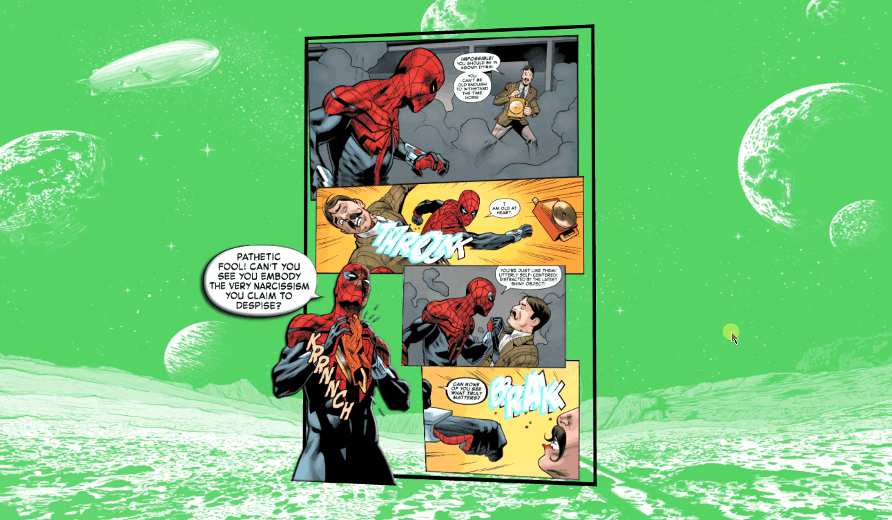
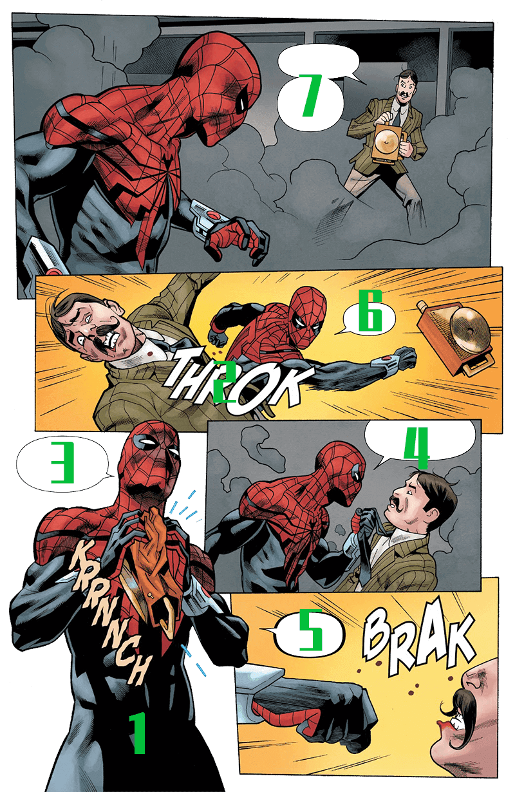

# 使用Three.js把喜欢的漫画图片改成惊艳的3D视觉吧🌟


> 声明：本文涉及图文和模型素材仅用于个人学习、研究和欣赏，请勿二次修改、非法传播、转载、出版、商用、及进行其他获利行为。

## 背景

## 效果




已适配:

* `💻` PC端
* `📱` 移动端

> `👀` 在线预览：<https://dragonir.github.io/3d/#/comic>

## 实现

### 素材制作

挑选一张自己喜欢的图片作为素材原图。



在Photoshop中打开图片，根据自己需要的分层数量，创建若干


### 场景初始化

```js
import React from 'react';
import * as THREE from "three";
import { OrbitControls } from "three/examples/jsm/controls/OrbitControls";
import { TWEEN } from "three/examples/jsm/libs/tween.module.min.js";
import Animations from '../../assets/utils/animations';
import layer_0 from './images/layer_0.png';
import layer_1 from './images/layer_1.png';
import layer_2 from './images/layer_2.png';
import layer_3 from './images/layer_3.png';
import layer_4 from './images/layer_4.png';
import layer_5 from './images/layer_5.png';
import layer_6 from './images/layer_6.png';
import layer_7 from './images/layer_7.png';
import background from './images/background.png';
import boomImage from './images/boom.png';

export default class Comic extends React.Component {

  componentDidMount() {
    this.initThree()
  }

  initThree = () => {
    var container, controls, stats, camera, scene, renderer, light, animateLayer = null, step = 0, layerGroup = new THREE.Group();
    var layers = [layer_0, layer_1, layer_2, layer_3, layer_4, layer_5, layer_6, layer_7];
    init();
    animate();
    function init() {
      container = document.getElementById('container');
      renderer = new THREE.WebGLRenderer({ antialias: true });
      renderer.setPixelRatio(window.devicePixelRatio);
      renderer.setSize(window.innerWidth, window.innerHeight);
      renderer.shadowMap.enabled = true;
      container.appendChild(renderer.domElement);

      scene = new THREE.Scene();
      scene.background = new THREE.TextureLoader().load(background);
      camera = new THREE.PerspectiveCamera(60, window.innerWidth / window.innerHeight, 0.1, 1000);
      camera.position.set(-12, 0, 0);
      camera.lookAt(new THREE.Vector3(0, 0, 0));

      const cube = new THREE.Mesh(new THREE.BoxGeometry(0.001, 0.001, 0.001), new THREE.MeshLambertMaterial({}));
      cube.position.set(0, 0, 0,);
      light = new THREE.DirectionalLight(0xffffff, 1);
      light.intensity = .2;
      light.position.set(10, 10, 30);
      light.castShadow = true;
      light.target = cube;
      light.shadow.mapSize.width = 512 * 12;
      light.shadow.mapSize.height = 512 * 12;
      light.shadow.camera.top = 100;
      light.shadow.camera.bottom = - 50;
      light.shadow.camera.left = - 50;
      light.shadow.camera.right = 100;
      scene.add(light);

      const ambientLight = new THREE.AmbientLight(0xdddddd);
      scene.add(ambientLight);

      // 创建8个面
      let aspect = 18;
      for (let i=0; i<layers.length; i++) {
        let mesh = new THREE.Mesh(new THREE.PlaneGeometry(10.41, 16), new THREE.MeshPhysicalMaterial({
          map: new THREE.TextureLoader().load(layers[i]),
          transparent: true,
          side: THREE.DoubleSide
        }));
        mesh.position.set(0, 0, i);
        mesh.scale.set(1 - (i / aspect), 1 - (i / aspect), 1 - (i / aspect));
        layerGroup.add(mesh);
        // 文字
        if (i === 5) {
          mesh.material.metalness = .6;
          mesh.material.emissive = new THREE.Color(0x55cfff);
          mesh.material.emissiveIntensity = 1.6;
          mesh.material.opacity = .9;
        }
        // 会话框
        if (i === 6) {
          mesh.scale.set(1.5, 1.5, 1.5);
          animateLayer = mesh;
        }
      }
      layerGroup.scale.set(1.2, 1.2, 1.2);
      // 创建boom背景
      const boom = new THREE.Mesh(new THREE.PlaneGeometry(36.76, 27.05), new THREE.MeshPhongMaterial({
        map: new THREE.TextureLoader().load(boomImage),
        transparent: true,
        shininess: 160,
        specular: new THREE.Color(0xff6d00),
        opacity: .7
      }));
      boom.scale.set(.8, .8, .8);
      boom.position.set(0, 0, -3);
      layerGroup.add(boom)
      scene.add(layerGroup);

      controls = new OrbitControls(camera, renderer.domElement);
      controls.target.set(0, 0, 0);
      controls.enableDamping = true;
      controls.enablePan = false;
      // 垂直旋转角度限制
      controls.minPolarAngle = 1.2;
      controls.maxPolarAngle = 1.8;
      // 水平旋转角度限制
      controls.minAzimuthAngle = -.6;
      controls.maxAzimuthAngle = .6;
      window.addEventListener('resize', onWindowResize, false);
      Animations.animateCamera(camera, controls, { x: 0, y: 0, z: 20 }, { x: 0, y: 0, z: 0 }, 3600, () => { });
    }

    function onWindowResize() {
      camera.aspect = window.innerWidth / window.innerHeight;
      camera.updateProjectionMatrix();
      renderer.setSize(window.innerWidth, window.innerHeight);
    }
    function animate() {
      requestAnimationFrame(animate);
      renderer.render(scene, camera);
      stats && stats.update();
      controls && controls.update();
      TWEEN && TWEEN.update();
      step += 0.01;
      animateLayer.position.x = 2.4 + Math.cos(step);
      animateLayer.position.y = .4 + Math.abs(Math.sin(step));
    }
  }

  render () {
    return (
      <div id="container"></div>
    )
  }
}
```

```
Phong网格材质(MeshPhongMaterial)
一种用于具有镜面高光的光泽表面的材质。

该材质使用非物理的Blinn-Phong模型来计算反射率。 与MeshLambertMaterial中使用的Lambertian模型不同，该材质可以模拟具有镜面高光的光泽表面（例如涂漆木材）。

使用Phong着色模型计算着色时，会计算每个像素的阴影（在fragment shader， AKA pixel shader中），与MeshLambertMaterial使用的Gouraud模型相比，该模型的结果更准确，但代价是牺牲一些性能。 MeshStandardMaterial和MeshPhysicalMaterial也使用这个着色模型。

在MeshStandardMaterial或MeshPhysicalMaterial上使用此材质时，性能通常会更高 ，但会牺牲一些图形精度。

构造函数(Constructor)
MeshPhongMaterial( parameters : Object )
parameters - (可选)用于定义材质外观的对象，具有一个或多个属性。 材质的任何属性都可以从此处传入(包括从Material继承的任何属性)。

属性color例外，其可以作为十六进制字符串传递，默认情况下为 0xffffff（白色），内部调用Color.set(color)。

属性(Properties)
共有属性请参见其基类Material。

.alphaMap : Texture
alpha贴图是一张灰度纹理，用于控制整个表面的不透明度。（黑色：完全透明；白色：完全不透明）。 默认值为null。

仅使用纹理的颜色，忽略alpha通道（如果存在）。 对于RGB和RGBA纹理，WebGL渲染器在采样此纹理时将使用绿色通道， 因为在DXT压缩和未压缩RGB 565格式中为绿色提供了额外的精度。 Luminance-only以及luminance/alpha纹理也仍然有效。

.aoMap : Texture
该纹理的红色通道用作环境遮挡贴图。默认值为null。aoMap需要第二组UVs，因此将忽略repeat和offset属性。

.aoMapIntensity : Float
环境遮挡效果的强度。默认值为1。零是不遮挡效果。

.bumpMap : Texture
用于创建凹凸贴图的纹理。黑色和白色值映射到与光照相关的感知深度。凹凸实际上不会影响对象的几何形状，只影响光照。如果定义了法线贴图，则将忽略该贴图。

.bumpScale : Float
凹凸贴图会对材质产生多大影响。典型范围是0-1。默认值为1。

.color : Color
材质的颜色(Color)，默认值为白色 (0xffffff)。

.combine : Integer
如何将表面颜色的结果与环境贴图（如果有）结合起来。

选项为THREE.Multiply（默认值），THREE.MixOperation， THREE.AddOperation。如果选择多个，则使用.reflectivity在两种颜色之间进行混合。

.displacementMap : Texture
位移贴图会影响网格顶点的位置，与仅影响材质的光照和阴影的其他贴图不同，移位的顶点可以投射阴影，阻挡其他对象， 以及充当真实的几何体。位移纹理是指：网格的所有顶点被映射为图像中每个像素的值（白色是最高的），并且被重定位。

.displacementScale : Float
位移贴图对网格的影响程度（黑色是无位移，白色是最大位移）。如果没有设置位移贴图，则不会应用此值。默认值为1。

.displacementBias : Float
位移贴图在网格顶点上的偏移量。如果没有设置位移贴图，则不会应用此值。默认值为0。

.emissive : Color
材质的放射（光）颜色，基本上是不受其他光照影响的固有颜色。默认为黑色。

.emissiveMap : Texture
设置放射（发光）贴图。默认值为null。放射贴图颜色由放射颜色和强度所调节。 如果你有一个放射贴图，请务必将放射颜色设置为黑色以外的其他颜色。

.emissiveIntensity : Float
放射光强度。调节发光颜色。默认为1。

.envMap : TextureCube
环境贴图。默认值为null。

.isMeshPhongMaterial : Boolean
用于检查此类或派生类是否为Phong网格材质。默认值为 true。

因为其通常用在内部优化，所以不应该更改该属性值。

.lightMap : Texture
光照贴图。默认值为null。lightMap需要第二组UVs，因此将忽略repeat和offset纹理属性。

.lightMapIntensity : Float
烘焙光的强度。默认值为1。

.map : Texture
颜色贴图。默认为null。纹理贴图颜色由漫反射颜色.color调节。

.morphNormals : boolean
定义是否使用morphNormals。设置为true可将morphNormal属性从Geometry传递到shader。默认值为false。

.morphTargets : Boolean
定义材质是否使用morphTargets。默认值为false。

.normalMap : Texture
用于创建法线贴图的纹理。RGB值会影响每个像素片段的曲面法线，并更改颜色照亮的方式。法线贴图不会改变曲面的实际形状，只会改变光照。

.normalMapType : Integer
法线贴图的类型。

选项为THREE.TangentSpaceNormalMap（默认）和THREE.ObjectSpaceNormalMap。

.normalScale : Vector2
法线贴图对材质的影响程度。典型范围是0-1。默认值是Vector2设置为（1,1）。

.reflectivity : Float
环境贴图对表面的影响程度; 见.combine。默认值为1，有效范围介于0（无反射）和1（完全反射）之间。

.refractionRatio : Float
空气的折射率（IOR）（约为1）除以材质的折射率。它与环境映射模式THREE.CubeRefractionMapping 和THREE.EquirectangularRefractionMapping一起使用。 折射率不应超过1。默认值为0.98。

.shininess : Float
.specular高亮的程度，越高的值越闪亮。默认值为 30。

.skinning : Boolean
材质是否使用蒙皮。默认值为false。

.specular : Color
材质的高光颜色。默认值为0x111111（深灰色）的颜色Color。

这定义了材质的光泽度和光泽的颜色。

.specularMap : Texture
镜面反射贴图值会影响镜面高光以及环境贴图对表面的影响程度。默认值为null。

.wireframe : Boolean
将几何体渲染为线框。默认值为false（即渲染为平面多边形）。

.wireframeLinecap : String
定义线两端的外观。可选值为 'butt'，'round' 和 'square'。默认为'round'。

该属性对应2D Canvas lineJoin属性， 并且会被WebGL渲染器忽略。

.wireframeLinejoin : String
定义线连接节点的样式。可选值为 'round', 'bevel' 和 'miter'。默认值为 'round'。

该属性对应2D Canvas lineJoin属性， 并且会被WebGL渲染器忽略。

.wireframeLinewidth : Float
控制线框宽度。默认值为1。

由于OpenGL Core Profile与 大多数平台上WebGL渲染器的限制，无论如何设置该值，线宽始终为1。

方法(Methods)
共有方法请参见其基类Material。
```

## 总结

> 想了解场景初始化、光照、阴影、基础几何体、网格、材质及其他 `Three.js` 的相关知识，可阅读我往期文章。**转载请注明原文地址和作者**。如果觉得文章对你有帮助，不要忘了**一键三连哦 👍**。

## 附录

* [1]. [Three.js 实现2022冬奥主题3D趣味页面 🐼](https://juejin.cn/post/7060292943608807460)
* [2]. [1000粉！使用Three.js制作一个专属3D奖牌 🥇](https://juejin.cn/post/7055079293247815711)
* [3]. [Three.js 实现虎年春节3D创意页面](https://juejin.cn/post/7051745314914435102)
* [4]. [Three.js 实现脸书元宇宙3D动态Logo](https://juejin.cn/post/7031893833163997220)
* [5]. [Three.js 实现3D全景侦探小游戏](https://juejin.cn/post/7042298964468564005)
* [6]. [Three.js实现炫酷的酸性风格3D页面](https://juejin.cn/post/7012996721693163528)
* [7]. [3dx模型转换为blender支持格式](https://anyconv.com/tw/max-zhuan-obj/)
