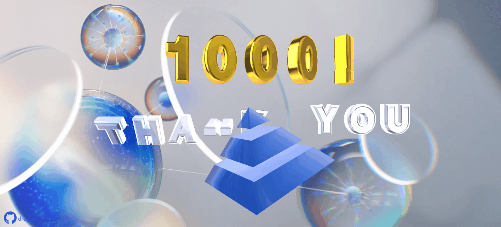
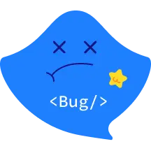
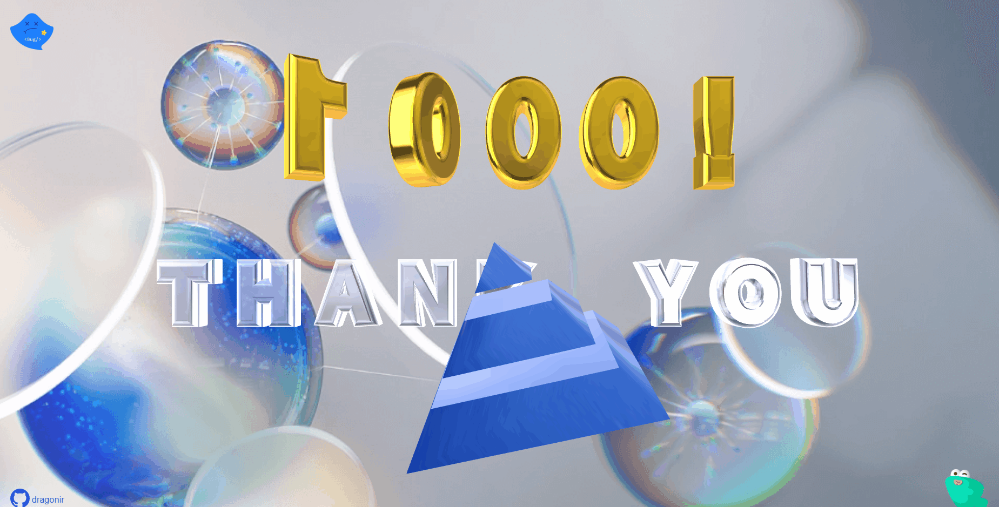
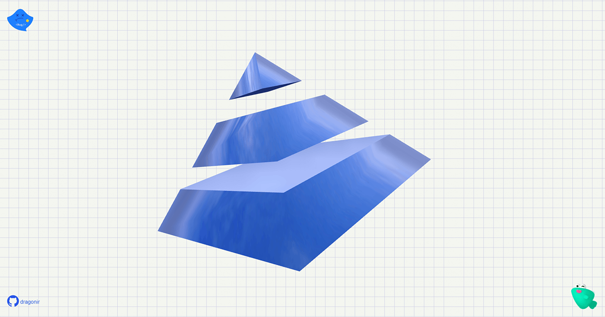
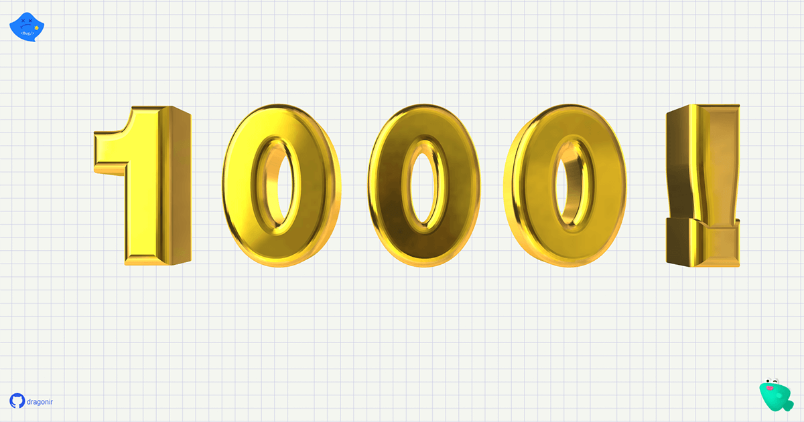
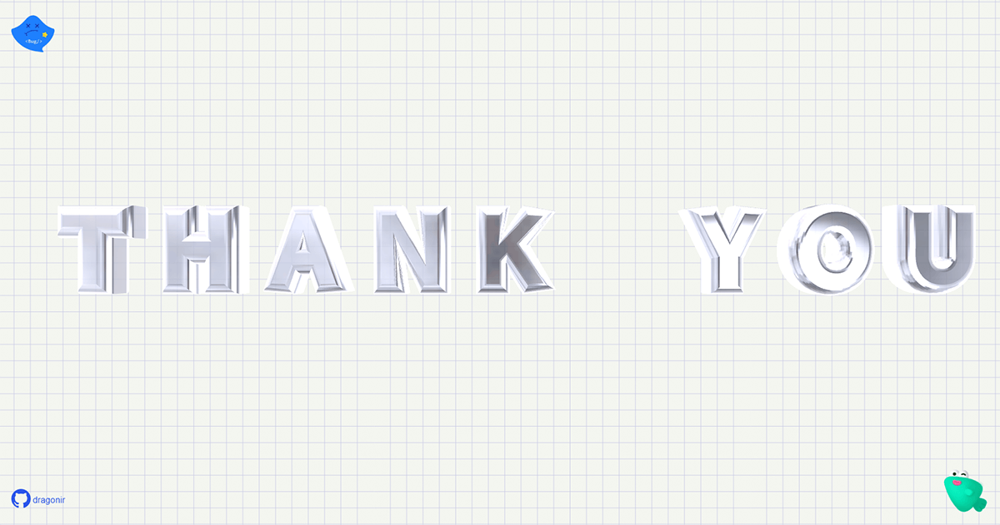
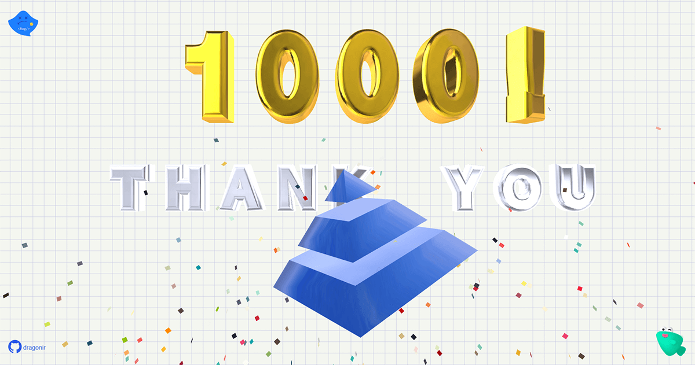
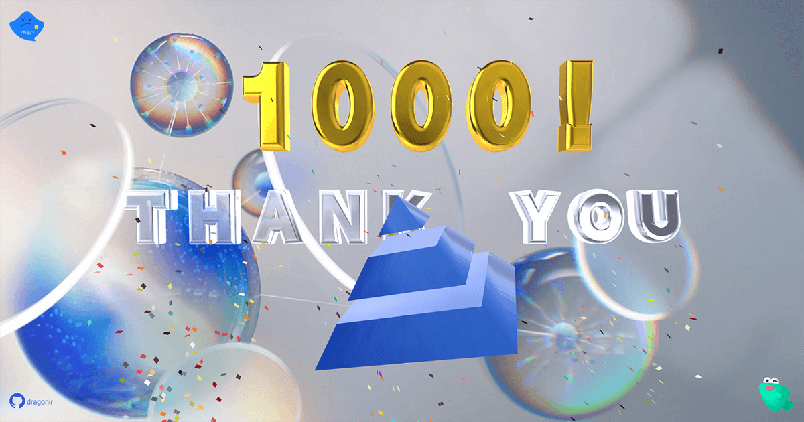
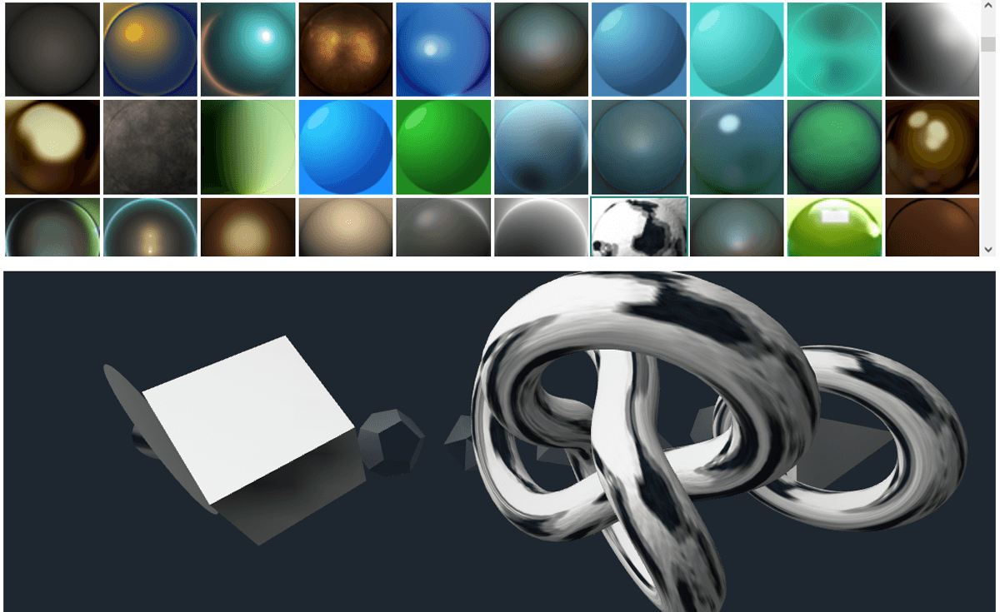
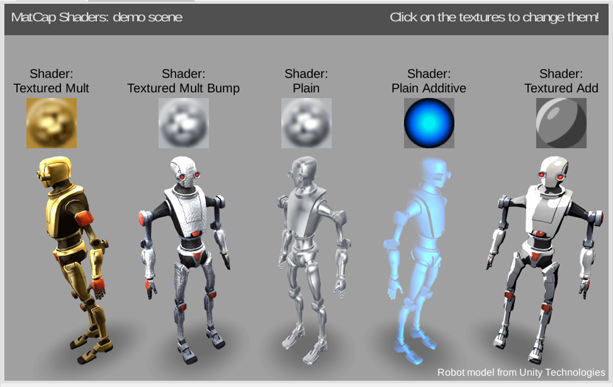

# 掘金1000粉！使用Three.js实现一个创意纪念页面 🏆



> 声明：本文涉及图文和模型素材仅用于个人学习、研究和欣赏，请勿二次修改、非法传播、转载、出版、商用、及进行其他获利行为。



## 背景

不知不觉，掘金关注者已经超过 `1000` 人了，因此特地做了这个页面纪念一下。

## 效果

页面主体内容主要由四部分组成，分别是：文字 `1000!`、文字 `THANK YOU`、掘金三维 `Logo`、以及 `纸片礼花` `🎉`。

* `💻` 本页面适配**PC端**和**移动端**，大屏访问效果更佳。
* `👁‍🗨` 在线预览地址1：<https://3d-eosin.vercel.app/#/fans>
* `👁‍🗨` 在线预览地址2：<https://dragonir.github.io/3d/#/fans>



## 实现

### `📦` 资源引入

引入开发必备的资源，其中除了基础的 `React` 和样式表之外，`dat.gui` 用于动态控制页面参数，其他剩余的主要分为两部分：**Three.js**相关， `OrbitControls` 用于镜头轨道控制、`TWEEN` 用于补间动画控制、`mergeBufferGeometries` 用户合并模型、`EffectComposer` `RenderPass` `GlitchPass` 用于生成后期故障效果动画、 `lineFragmentShader` 是飞线的 `Shader`、**Echarts**相关按需引入需要的组件，最后使用 `echarts.use` 使其生效。

### `📃` 页面结构

页面主要结构如以下代码所示，`.webgl` 用于渲染 `3D` 数字地球；`.header` 是页面顶部，里面包括**时间**、**日期**、**星际坐标**、`Cyberpunk 2077 Logo`、本人 `Github` 仓库地址等；`.aside` 是左右两侧的图表展示区域；`.footer` 是底部的仪表盘，展示一些雷达动画和文本信息；如果仔细观察，可以看出背景有**噪点**效果，`.bg` 就是用于生成噪点背景效果。

### 创建掘金 `Logo`

```js
// 创建logo
const logo = new THREE.Group();
const logoMaterial = new THREE.MeshMatcapMaterial({
  matcap: this.matcaps.logoMatcap,
  side: THREE.DoubleSide,
})
const cone = new THREE.Mesh(new THREE.ConeGeometry(4, 4, 4), logoMaterial);
logo.add(cone);
const cylinder = new THREE.Mesh(new THREE.CylinderGeometry(6, 10, 4, 4, 1), logoMaterial);
cylinder.position.y = -6
logo.add(cylinder);
const cylinder2 = new THREE.Mesh(new THREE.CylinderGeometry(12, 16, 4, 4, 1), logoMaterial);
cylinder2.position.y = -12
logo.add(cylinder2);
logo.position.set(0, 0, 0);
logo.scale.set(11, 11, 11);
logo.rotateY(Math.PI * 0.2);
logo.rotateZ(Math.PI * 0.1);
scene.add(logo);
```



### 创建文字 `1000!`

```js
new Text({
  ...DEFAULTS,
  text: '1000!',
  position: new THREE.Vector3(120, 160, -80),
  textOptions: {
    size: 110,
    spacing: 120
  },
  material: {
    matcap: this.matcaps.textMatcap1
  },
  animation: 'zoomAndFlip',
  onLoad: () => {
    this.confetti.pop(2);
  },
});
```



### 创建文字 `THANK YOU`

```js
new Text({
  ...DEFAULTS,
  text: 'THANK YOU',
  position: new THREE.Vector3(-120, -10, -80),
  textOptions: {
    size: 60,
    spacing: 100,
  },
  material: {
    matcap: this.matcaps.textMatcap2,
    opacity: .75
  },
  animation: 'upDownFlip',
});
```



### 创建礼花 `🎉`



### 缩放监听及重绘动画

```js
const animate = () => {
  requestAnimationFrame(animate);
  controls && controls.update();
  logo && logo.rotateOnAxis(axis, Math.PI / 400);
  renderer.render(scene, camera);
}
animate();

window.addEventListener('pointermove', e => {
  e.preventDefault();
  this.mousePosition.x = e.clientX;
  this.mousePosition.y = e.clientY;
});

window.addEventListener('pointerdown', e => {
  e.preventDefault();
  this.confetti && this.confetti.pop();
});

window.addEventListener('resize', () => {
  this.width = window.innerWidth;
  this.height = window.innerHeight;
  this.camera.aspect = this.width / this.height;
  this.camera.updateProjectionMatrix();
  renderer.setPixelRatio(Math.min(window.devicePixelRatio, 2));
  this.renderer.setSize(this.width, this.height);
}, {
  passive: true
});
```

### 样式细节优化

到这一步，页面的全部功能全部完成了，现在来装饰一下页面，将 `renderer` 设置为透明，然后在 `CSS` 中使用一张好看的科技感图片作为页面背景，最后加上几个角落里的图片装饰物和 `Github` 图标链接，加一点点 `CSS` 动画，页面整体视觉效果就得到了不错的提升 `😉`。



https://observablehq.com/@makio135/matcaps?ui=classic

https://github.com/nidorx/matcaps

http://jeanmoreno.com/unity/matcap/

### `💡` MeshMatcapMaterial





`MeshMatcapMaterial` 由一个材质捕捉（MatCap，或光照球（Lit Sphere））纹理所定义，其编码了材质的颜色与明暗。
由于mapcap图像文件编码了烘焙过的光照，因此MeshMatcapMaterial 不对灯光作出反应。
它将会投射阴影到一个接受阴影的物体上(and shadow clipping works)，但不会产生自身阴影或是接受阴影。

**构造函数**：

```js
MeshMatcapMaterial(parameters: Object)
```

`parameters`：可选，用于定义材质外观的对象，具有一个或多个属性，材质的任何属性都可以从此处传入，包括从 `Material` 继承的任何属性。

* `.color[Color]`：材质的颜色，默认值为白色 `0xffffff`。
* `.matcap[Texture]`：`matcap` 贴图，默认为 `null`。
* 共有属性请参见其基类Material。

## 总结

本文包含的知识点主要包括：

> 想了解其他前端知识或其他未在本文中详细描述的 `Web 3D` 开发技术相关知识，可阅读我往期的文章。**转载请注明原文地址和作者**。如果觉得文章对你有帮助，不要忘了**一键三连哦 👍**。

## 附录

* [我的3D专栏可以点击此链接访问 👈](https://juejin.cn/column/7049923956257587213)
* [1]. [🦊 Three.js 实现3D开放世界小游戏：阿狸的多元宇宙](https://juejin.cn/post/7081429595689320478)
* [2]. [🔥 Three.js 火焰效果实现艾尔登法环动态logo](https://juejin.cn/post/7077726955528781832)
* [3]. [🐼 Three.js 实现2022冬奥主题3D趣味页面，含冰墩墩](https://juejin.cn/post/7060292943608807460)
* `...`

* [1]. [📷 前端实现很哇塞的浏览器端扫码功能](https://juejin.cn/post/7018722520345870350)
* [2]. [🌏 前端瓦片地图加载之塞尔达传说旷野之息](https://juejin.cn/post/7007432493569671182)
* [3]. [😱 仅用CSS几步实现赛博朋克2077风格视觉效果](https://juejin.cn/post/6972759988632551460)
* `...`

## 参考

* [1]. [https://threejs.org](https://threejs.org)
* [2]. [https://github.com/dataarts/dat.gui/blob/master/API.md](https://github.com/dataarts/dat.gui/blob/master/API.md)
* [3]. [https://echarts.apache.org/zh/index.html](https://echarts.apache.org/zh/index.html)
* [4]. [https://www.cnblogs.com/pangys/p/13276936.html](https://www.cnblogs.com/pangys/p/13276936.html)
* [5]. [https://developer.mozilla.org/zh-CN/docs/Web/CSS/gradient/radial-gradient](https://developer.mozilla.org/zh-CN/docs/Web/CSS/gradient/radial-gradient)
* [6]. [https://developer.mozilla.org/zh-CN/docs/Web/CSS/clip-path](https://developer.mozilla.org/zh-CN/docs/Web/CSS/clip-path)