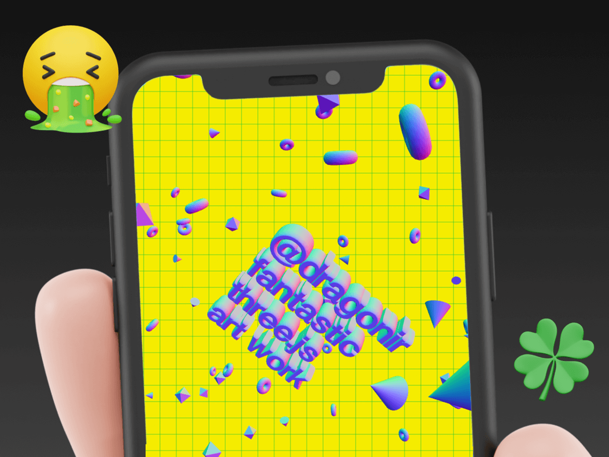
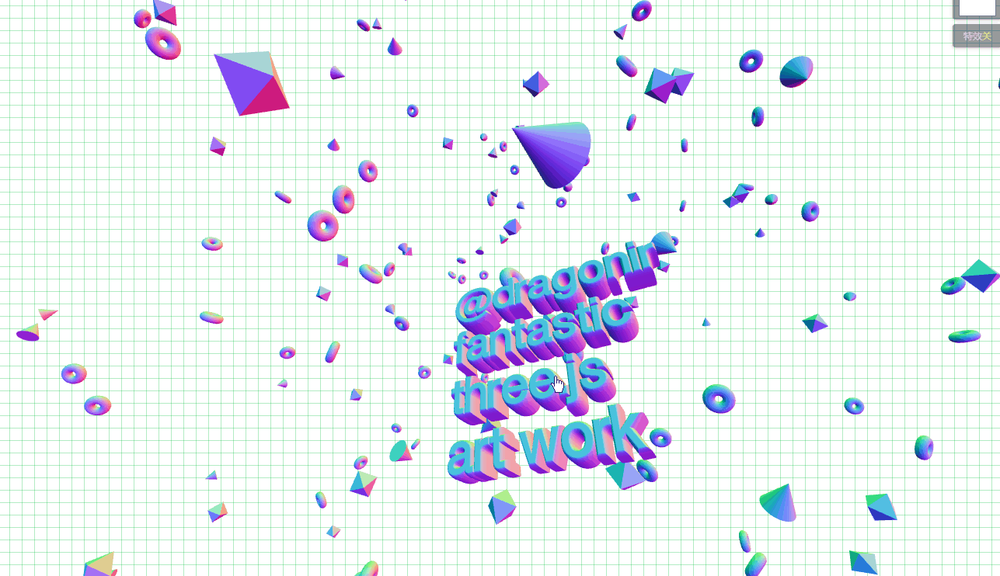
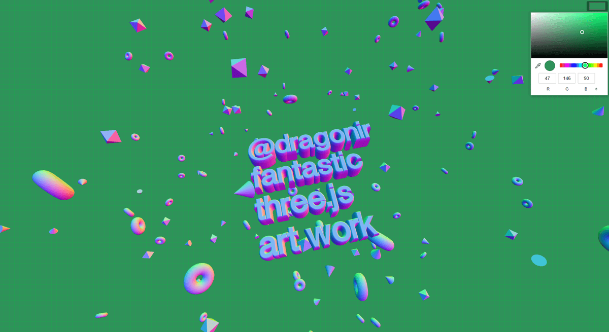

# 使用Three.js内置方法实现惊艳的浮动文字效果


## 背景

在 Three.js Journey 课程示例中，提供了一个仅通过Three.js内置方法实现的浮动文字效果的[示例](https://www.ilithya.rocks/)，于是本文参照示例，实现类似的效果。本文使用React+Three.js技术栈，本文中涉及到的知识点主要包括：

## 效果

本文实现效果：



> `👀` 在线预览：<https://dragonir.github.io/3d/#/floating>

已适配移动端

## 实现

### 资源引入

```js
import './index.styl';
import React from 'react';
import * as THREE from "three";
import { FontLoader } from "three/examples/jsm/loaders/FontLoader";
import { TextGeometry } from 'three/examples/jsm/geometries/TextGeometry'
import { EffectComposer } from 'three/examples/jsm/postprocessing/EffectComposer.js';
import { RenderPass } from 'three/examples/jsm/postprocessing/RenderPass.js';
import { GlitchPass } from 'three/examples/jsm/postprocessing/GlitchPass.js';
```

### DOM结构

```html
<div className='floating_page' style={{ backgroundColor: this.state.backgroundColor }}>
  <div id="canvas"></div>
  <input className='color_pick' type="color" onChange={this.handleInputChange} value={this.state.backgroundColor} />
  <button className='pass_button' onClick={this.handleRenderChange}>特效<span className='highlight'>{this.state.renderGlithPass ? '开' : '关'}</span></button>
</div>
```

ios safari，因此手机端默认关闭后期特效、pc端默认开启

```js
state = {
  backgroundColor: '#164CCA',
  renderGlithPass: !(window.navigator.userAgent.toLowerCase().indexOf('mobile') > 0)
}
```

### 场景初始化

```js
canvas = document.getElementById('canvas');
renderer = new THREE.WebGLRenderer({ antialias: true, alpha: true });
renderer.setPixelRatio(Math.min(2, window.devicePixelRatio));
renderer.setSize(window.innerWidth, window.innerHeight);
renderer.setClearAlpha(0);
canvas.appendChild(renderer.domElement);
scene = new THREE.Scene();
scene.fog = new THREE.Fog(0xeeeeee, 0, 100);
camera = new THREE.PerspectiveCamera(70, window.innerWidth / window.innerHeight, .1, 10000);
camera.position.set(-2 * 10000, 0, 780);
```

### 创建文字模型

```js
const material = new THREE.MeshNormalMaterial();
```

#### MeshNormalMaterial

一种把法向量映射到RGB颜色的材质。

// iOS iframe auto-resize workaround
if ( /(iPad|iPhone|iPod)/g.test( navigator.userAgent ) ) {
const scene = document.getElementById( ‘scene’ );
scene.style.width = getComputedStyle( scene ).width;
scene.style.height = getComputedStyle( scene ).height;
scene.setAttribute( ‘scrolling’, ‘no’ );
}

构造函数(Constructor)
MeshNormalMaterial( parameters : Object )
parameters – (可选)用于定义材质外观的对象，具有一个或多个属性。材质的任何属性都可以从此处传入(包括从Material继承的任何属性)。

属性(Properties)
共有属性请参见其基类Material。

.bumpMap : Texture
用于创建凹凸贴图的纹理。黑色和白色值映射到与光照相关的感知深度。凹凸实际上不会影响对象的几何形状，只影响光照。如果定义了法线贴图，则将忽略该贴图。

.bumpScale : Float
凹凸贴图会对材质产生多大影响。典型范围是0-1。默认值为1。

.displacementMap : Texture
位移贴图会影响网格顶点的位置，与仅影响材质的光照和阴影的其他贴图不同，移位的顶点可以投射阴影，阻挡其他对象，
以及充当真实的几何体。位移纹理是指：网格的所有顶点被映射为图像中每个像素的值（白色是最高的），并且被重定位。

.displacementScale : Float
位移贴图对网格的影响程度（黑色是无位移，白色是最大位移）。如果没有设置位移贴图，则不会应用此值。默认值为1。

.displacementBias : Float
位移贴图在网格顶点上的偏移量。如果没有设置位移贴图，则不会应用此值。默认值为0。

.flatShading : Boolean
定义材质是否使用平面着色进行渲染。默认值为false。

.fog : Boolean
材质是否受雾影响。默认值为false。

.morphNormals : Boolean
定义是否使用morphNormals。设置为true可将morphNormal属性从geometry传递到shader。默认值为false。

.morphTargets : Boolean
定义材质是否使用morphTargets。默认值为false。

.normalMap : Texture
用于创建法线贴图的纹理。RGB值会影响每个像素片段的曲面法线，并更改颜色照亮的方式。法线贴图不会改变曲面的实际形状，只会改变光照。
In case the material has a normal map authored using the left handed convention, the y component of normalScale
should be negated to compensate for the different handedness.

.normalMapType : Integer
法线贴图的类型。

选项为THREE.TangentSpaceNormalMap（默认）和THREE.ObjectSpaceNormalMap。

.normalScale : Vector2
法线贴图对材质的影响程度。典型范围是0-1。默认值是Vector2设置为（1,1）。

.wireframe : Boolean
将几何体渲染为线框。默认值为false（即渲染为平滑着色）。

.wireframeLinewidth : Float
控制线框宽度。默认值为1。

由于OpenGL Core Profile与大多数平台上WebGL渲染器的限制，无论如何设置该值，线宽始终为1。

方法(Methods)
共有方法请参见其基类Material。

源码(Source)
src/materials/MeshNormalMaterial.js

```js
// 字体
const loader = new FontLoader();
loader.load('./fonts/helvetiker_regular.typeface.json', font => {
  textMesh.geometry = new TextGeometry('@dragonir\nfantastic\nthree.js\nart work', {
    font: font,
    size: 100,
    height: 40,
    curveSegments: 12,
    bevelEnabled: true,
    bevelThickness: 30,
    bevelSize: 8,
    bevelOffset: 1,
    bevelSegments: 12
  });
  textMesh.material = material;
  textMesh.position.x = 120 * -2;
  textMesh.position.z = 120 * -1;
  scene.add(textMesh);
});
```


构造器
TextGeometry(text : String, parameters : Object)
text — 将要显示的文本。
parameters — 包含有下列参数的对象：

font — THREE.Font的实例。
size — Float。字体大小，默认值为100。
height — Float。挤出文本的厚度。默认值为50。
curveSegments — Integer。（表示文本的）曲线上点的数量。默认值为12。
bevelEnabled — Boolean。是否开启斜角，默认为false。
bevelThickness — Float。文本上斜角的深度，默认值为20。
bevelSize — Float。斜角与原始文本轮廓之间的延伸距离。默认值为8。
bevelSegments — Integer。斜角的分段数。默认值为3。
可用的字体
文本几何体使用 typeface.json所生成的字体。

### 创建几何体模型

```js
function generateRandomMesh(geometry, material, count){
for (let i = 0; i < count; i++) {
  let mesh = new THREE.Mesh(geometry, material);
  let dist = farDist / 3;
  let distDouble = dist * 2;
  let tau = 2 * Math.PI;
  mesh.position.x = Math.random() * distDouble - dist;
  mesh.position.y = Math.random() * distDouble - dist;
  mesh.position.z = Math.random() * distDouble - dist;
  mesh.rotation.x = Math.random() * tau;
  mesh.rotation.y = Math.random() * tau;
  mesh.rotation.z = Math.random() * tau;
  // 手动控制何时重新计算 3D 变换以获得更好的性能
  mesh.matrixAutoUpdate = false;
  mesh.updateMatrix();
  group.add(mesh);
}
}
```


```js
// BufferAttribute 允许更有效地将数据传递到 GPU
const octahedronGeometry = new THREE.OctahedronBufferGeometry(80);
const material = new THREE.MeshNormalMaterial();
generateRandomMesh(octahedronGeometry, material, 100);
const torusGeometry = new THREE.TorusBufferGeometry(40, 25, 16, 40);
generateRandomMesh(torusGeometry, material, 200);
const coneGeometry = new THREE.ConeBufferGeometry(40, 80, 80);
generateRandomMesh(coneGeometry, material, 100);
scene.add(group);
```

#### OctahedronBufferGeometry

八面缓冲几何体（OctahedronGeometry）
发布于 2021-07-10 字数 1198 浏览 1079 评论 0
一个用于创建八面体的类。

// iOS iframe auto-resize workaround
if ( /(iPad|iPhone|iPod)/g.test( navigator.userAgent ) ) {
const scene = document.getElementById( ‘scene’ );
scene.style.width = getComputedStyle( scene ).width;
scene.style.height = getComputedStyle( scene ).height;
scene.setAttribute( ‘scrolling’, ‘no’ );
}

构造器
OctahedronGeometry(radius : Float, detail : Integer)
radius — 八面体的半径，默认值为1。
detail — 默认值为0，将这个值设为一个大于0的数将会为它增加一些顶点，使其不再是一个八面体。

属性
共有属性请参见其基类PolyhedronGeometry。

.parameters : Object
一个包含着构造函数中每个参数的对象。在对象实例化之后，对该属性的任何修改都不会改变这个几何体。

方法(Methods)
共有方法请参见其基类PolyhedronGeometry。

#### `💡` TorusBufferGeometry

圆环缓冲几何体（TorusGeometry）

一个用于生成圆环几何体的类。

// iOS iframe auto-resize workaround
if ( /(iPad|iPhone|iPod)/g.test( navigator.userAgent ) ) {
const scene = document.getElementById( ‘scene’ );
scene.style.width = getComputedStyle( scene ).width;
scene.style.height = getComputedStyle( scene ).height;
scene.setAttribute( ‘scrolling’, ‘no’ );
}

代码示例
const geometry = new THREE.TorusGeometry( 10, 3, 16, 100 );
const material = new THREE.MeshBasicMaterial( { color: 0xffff00 } );
const torus = new THREE.Mesh( geometry, material );
scene.add( torus );
构造器
TorusGeometry(radius : Float, tube : Float, radialSegments : Integer, tubularSegments : Integer, arc : Float)
radius – 圆环的半径，从圆环的中心到管道（横截面）的中心。默认值是1。
tube — 管道的半径，默认值为0.4。
radialSegments — 圆环的分段数，默认值为8。
tubularSegments — 管道的分段数，默认值为6。
arc — 圆环的圆心角（单位是弧度），默认值为Math.PI * 2。

属性
共有属性请参见其基类BufferGeometry。

.parameters
一个包含着构造函数中每个参数的对象。在对象实例化之后，对该属性的任何修改都不会改变这个几何体。

方法(Methods)
共有方法请参见其基类BufferGeometry。

源代码
src/geometries/TorusGeometry.js

#### ConeBufferGeometry


圆锥缓冲几何体（ConeGeometry）
发布于 2021-07-10 字数 1884 浏览 1037 评论 0
一个用于生成圆锥几何体的类。

// iOS iframe auto-resize workaround
if ( /(iPad|iPhone|iPod)/g.test( navigator.userAgent ) ) {
const scene = document.getElementById( ‘scene’ );
scene.style.width = getComputedStyle( scene ).width;
scene.style.height = getComputedStyle( scene ).height;
scene.setAttribute( ‘scrolling’, ‘no’ );
}

代码示例
const geometry = new THREE.ConeGeometry( 5, 20, 32 );
const material = new THREE.MeshBasicMaterial( {color: 0xffff00} );
const cone = new THREE.Mesh( geometry, material );
scene.add( cone );
构造器
ConeGeometry(radius : Float, height : Float, radialSegments : Integer, heightSegments : Integer, openEnded : Boolean, thetaStart : Float, thetaLength : Float)
radius — 圆锥底部的半径，默认值为1。
height — 圆锥的高度，默认值为1。
radialSegments — 圆锥侧面周围的分段数，默认为8。
heightSegments — 圆锥侧面沿着其高度的分段数，默认值为1。
openEnded — 一个Boolean值，指明该圆锥的底面是开放的还是封顶的。默认值为false，即其底面默认是封顶的。
thetaStart — 第一个分段的起始角度，默认为0。（three o’clock position）
thetaLength — 圆锥底面圆扇区的中心角，通常被称为“θ”（西塔）。默认值是2*Pi，这使其成为一个完整的圆锥。

属性
共有属性请参见其基类CylinderGeometry。

.parameters : Object
一个包含着构造函数中每个参数的对象。在对象实例化之后，对该属性的任何修改都不会改变这个几何体。

方法(Methods)
共有方法请参见其基类CylinderGeometry。

源代码
src/geometries/ConeGeometry.js

几何-ConeBufferGeometry（锥体）
用于生成锥形几何的类

var geometry = new THREE.ConeBufferGeometry( 5, 20, 32 ); var material = new THREE.MeshBasicMaterial( {color: 0xffff00} ); var cone = new THREE.Mesh( geometry, material ); scene.add( cone );
ConeBufferGeometry(radius : Float, height : Float, radialSegments : Integer, heightSegments : Integer, openEnded : Boolean, thetaStart : Float, thetaLength : Float)
radius - 锥底的半径。默认值为1。
height - 圆锥的高度。默认值为1。
radialSegments - 圆锥周围的分割面数。默认值为8。
heightSegments - 沿锥体高度的面的行数。默认值为1。
openEnded - 一个布尔值，指示锥体的底部是打开还是加盖。默认值为false，表示上限。
thetaStart - 第一段的起始角度，默认值为0（三点钟位置）。
thetaLength - 圆形扇区的中心角，通常称为θ（theta）。默认值为2 * Pi，这是一个完整的锥形。

.parameters : Object
每个构造函数参数都具有的对象属性。实例化后的任何修改都不会改变几何结构。


### 动画效果

```js
function animate() {
  requestAnimationFrame(animate);
  camera.position.x += (mouseX - camera.position.x) * 0.05;
  camera.position.y += (mouseY * -1 - camera.position.y) * 0.05;
  // 旋转世界空间中的每一个网格
  camera.lookAt(scene.position);
  const t = Date.now() * 0.001;
  const rx = Math.sin(t * 0.7) * 0.5;
  const ry = Math.sin(t * 0.3) * 0.5;
  const rz = Math.sin(t * 0.2) * 0.5;
  group.rotation.x = rx;
  group.rotation.y = ry;
  group.rotation.z = rz;
  textMesh.rotation.x = rx;
  textMesh.rotation.y = ry;
  textMesh.rotation.z = rx;
  renderer.render(scene, camera);
  _this.state.renderGlithPass && composer.render();
  stats && stats.update();
}
```



### 背景颜色切换

```js
handleInputChange = e => {
  this.setState({
    backgroundColor: e.target.value
  })
}
```



### 后期渲染开关

```js
  handleRenderChange = () => {
    this.setState({
      renderGlithPass: !this.state.renderGlithPass
    })
  }
```

### 后期渲染

```js
// 后期
composer = new EffectComposer(renderer);
composer.addPass( new RenderPass(scene, camera));
glitchPass = new GlitchPass();
composer.addPass(glitchPass);
```


### 缩放适配

```js
// 页面缩放
window.addEventListener('resize', () => {
  camera.aspect = window.innerWidth / window.innerHeight;
  camera.updateProjectionMatrix();
  renderer.setSize(window.innerWidth, window.innerHeight);
  composer.setSize( window.innerWidth, window.innerHeight );
}, false);
```

### 双击全屏

```js
// 双击全屏
window.addEventListener('dblclick', () => {
  const fullscreenElement = document.fullscreenElement || document.webkitFullscreenElement;
  if (!fullscreenElement) {
    if (canvas.requestFullscreen) {
      canvas.requestFullscreen();
    } else if (canvas.webkitRequestFullscreen) {
      canvas.webkitRequestFullscreen();
    }
    console.log('go fullscrenn')
    scene.background = new THREE.Color(_this.state.backgroundColor)
  } else {
    if (document.exitFullscreen) {
      document.exitFullscreen();
    } else if (document.webkitExitFullscreen) {
      document.webkitExitFullscreen();
    }
    console.log('leave fullscrenn')
    scene.background = '';
    composer.render();
  }
})
```

#### Element.requestFullscreen()

Element.requestFullscreen() 方法用于发出异步请求使元素进入全屏模式。

调用此API并不能保证元素一定能够进入全屏模式。如果元素被允许进入全屏幕模式，返回的Promise会resolve，并且该元素会收到一个fullscreenchange (en-US)事件，通知它已经进入全屏模式。如果全屏请求被拒绝，返回的promise会变成rejected并且该元素会收到一个fullscreenerror (en-US)事件。如果该元素已经从原来的文档中分离，那么该文档将会收到这些事件。

早期的Fullscreen API实现总是会把这些事件发送给document，而不是调用的元素，所以你自己可能需要处理这样的情况。参考 Browser compatibility in [Page not yet written] 来得知哪些浏览器做了这个改动。

注意：这个方法只能在用户交互或者设备方向改变的时候调用，否则将会失败。

语法
var Promise = Element.requestFullscreen(options);
参数
options 可选

一个FullscreenOptions (en-US)对象提供切换到全屏模式的控制选项。目前，唯一的选项是navigationUI (en-US)，这控制了是否在元素处于全屏模式时显示导航条UI。默认值是"auto"，表明这将由浏览器来决定是否显示导航条。

返回值
在完成切换全屏模式后，返回一个已经用值 undefined resolved的Promise

异常
requestFullscreen() 通过拒绝返回的 Promise来生成错误条件，而不是抛出一个传统的异常。拒绝控制器接收以下的某一个值：

TypeError
在以下几种情况下，会抛出TypeError：
文档中包含的元素未完全激活，也就是说不是当前活动的元素。
元素不在文档之内。
因为功能策略限制配置或其他访问控制，元素不被允许使用"fullscreen"功能。
元素和它的文档是同一个节点。 

#### Document.exitFullscreen()

Document.exitFullscreen() 方法用于让当前文档退出全屏模式（原文表述不准确，详见备注）。调用这个方法会让文档回退到上一个调用Element.requestFullscreen()方法进入全屏模式之前的状态。

备注: 如果一个元素A在请求进去全屏模式之前，已经存在其他元素处于全屏状态，当这个元素A退出全屏模式之后，之前的元素仍然处于全屏状态。浏览器内部维护了一个全屏元素栈用于实现这个目的。
语法
document.exitFullscreen();
示例
// 点击切换全屏模式
document.onclick = function (event) {
  if (document.fullscreenElement) {
    document.exitFullscreen()
  } else {
    document.documentElement.requestFullscreen()
  }
};
Copy to Clipboard
API规格


### 鼠标事件监听

```js
const mouseFX = {
  windowHalfX: window.innerWidth / 2,
  windowHalfY: window.innerHeight / 2,
  coordinates: (coordX, coordY) => {
    mouseX = (coordX - mouseFX.windowHalfX) * 5;
    mouseY = (coordY - mouseFX.windowHalfY) * 5;
  },
  onMouseMove: e => { mouseFX.coordinates(e.clientX, e.clientY) },
  onTouchMove: e => { mouseFX.coordinates(e.changedTouches[0].clientX, e.changedTouches[0].clientY)}
};
document.addEventListener('mousemove', mouseFX.onMouseMove, false);
document.addEventListener('touchmove', mouseFX.onTouchMove, false);
```

### 网格背景

```css
background: #164CCA;
background-image: linear-gradient(rgba(3, 192, 60, .3) 1px, transparent 1px), linear-gradient(90deg, rgba(3, 192, 60, .3) 1px, transparent 1px);
background-size: 1em 1em;
```

.1 认识后期处理
后期处理，其实就是原有的页面效果不能满足审美需求，通过一些技术手段以达到预期的效果，实现的过程就是后期处理。
在three.js中实现后期处理，需要经过以下几步

创建效果组合器
效果组合器是各种处理通道的入口，three.js提供了一个 EffectComposer 对象，使用它来创建一个效果组合器，从某种程度上说这个效果组合器是各种通道的容器，创建时需要一个渲染器的实例

添加通道
在后期处理过程中 renderPass 通道 必须要有，这个通道在指定的场景和相机的基础上渲染出一个新的场景，这里需要通过RenderPass对象创建一个通道实例，然后将它添加到效果组合器中；three.js 中提供了很多后期处理的通道，你可以直接来使用它们，只需要创建对应的通道，配置一些参数，将它们添加到效果组合器就可以了，这里特别说一下，three.js还提供了一个 ShaderPass 通道，它支持使用自定义的Shader创建高级的后期处理通道

更新通道
在render循环中，调用效果组合器的render函数，效果组合器会依次使用添加的处理通道来处理场景将最终的结果输出

### GlitchPass通道介绍
GlitchPass通道产生模拟电磁风暴效果，它只有一个参数配置
goWild 该属性接收一个布尔值，指定是否持续产生电磁风暴效果

> `🔗` 完整代码：<https://github.com/dragonir/3d/tree/master/src/containers/Floating>

## 总结

本文知识点主要包含的的新知识：

> 想了解场景初始化、光照、阴影、基础几何体、网格、材质及其他 `Three.js` 的相关知识，可阅读我往期文章。**转载请注明原文地址和作者**。如果觉得文章对你有帮助，不要忘了**一键三连哦 👍**。

## 附录

* [1]. [拜托，使用Three.js让二维图片具有3D效果超酷的好吗 💥](https://juejin.cn/post/7067344398912061454)
* [2]. [Three.js 实现2022冬奥主题3D趣味页面 🐼](https://juejin.cn/post/7060292943608807460)
* [3]. [1000粉！使用Three.js制作一个专属3D奖牌 🥇](https://juejin.cn/post/7055079293247815711)
* [4]. [Three.js 实现虎年春节3D创意页面](https://juejin.cn/post/7051745314914435102)
* [5]. [Three.js 实现脸书元宇宙3D动态Logo](https://juejin.cn/post/7031893833163997220)
* [6]. [Three.js 实现3D全景侦探小游戏](https://juejin.cn/post/7042298964468564005)
* [7]. [Three.js实现炫酷的酸性风格3D页面](https://juejin.cn/post/7012996721693163528)
* [8]. [3dx模型转换为blender支持格式](https://anyconv.com/tw/max-zhuan-obj/)
* [9]. [www.ilithya.rocks](https://www.ilithya.rocks/)
