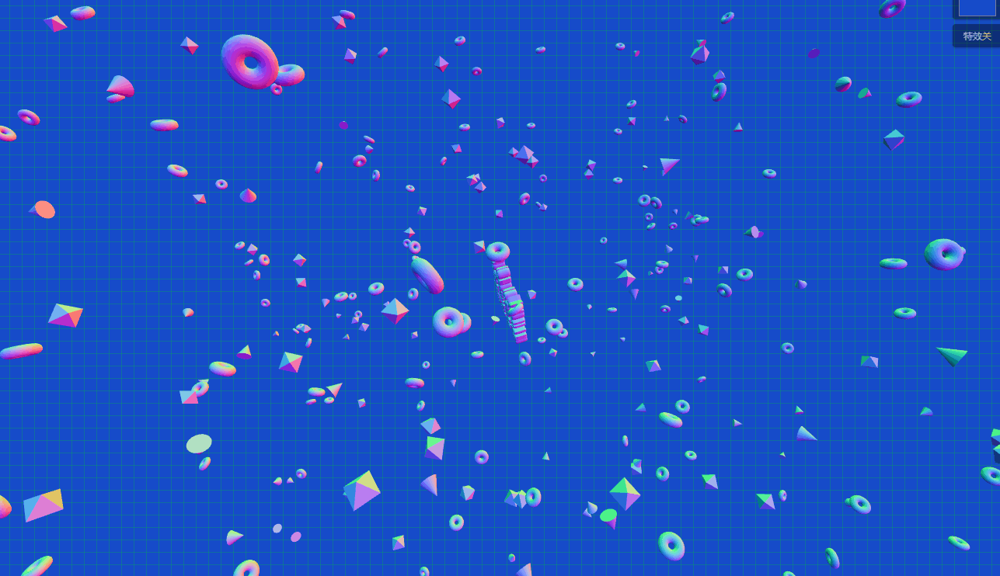
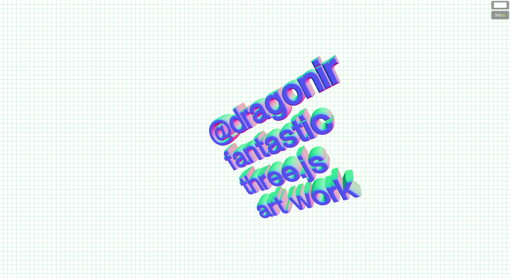
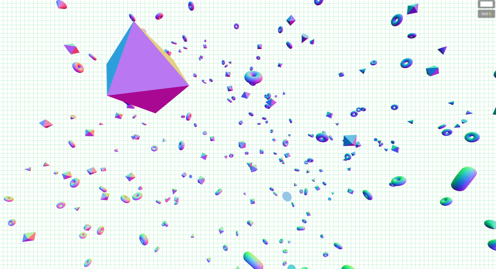

# 使用Three.js实现神奇的的3D文字悬浮效果



> 声明：本文涉及图文和模型素材仅用于个人学习、研究和欣赏，请勿二次修改、非法传播、转载、出版、商用、及进行其他获利行为。

## 背景

在 `Three.js Journey` 课程[示例](https://www.ilithya.rocks/)中，提供了一个仅通过Three.js内置方法实现的 `3D` 文字悬浮效果，于是本文参照示例，实现类似的效果。本文使用React+Three.js技术栈，本文中涉及到的知识点主要包括：`CSS` 网格背景、`MeshNormalMaterial` 法向材质、`FontLoader` 字体加载器、`TextGeometry` 文本缓冲几何体、`TorusBufferGeometry` 圆环缓冲几何体、`ConeBufferGeometry` 圆锥缓冲几何体、`OctahedronBufferGeometry` 八面缓冲几何体、`Three.js` 后期渲染、`GlitchPass` 通道、`Element.requestFullscreen`、`Document.exitFullscreen` 等。

## 效果

本文实现效果如 `banner` 图所示，页面主体由位于中心的**文字网格模型以及四周的圆环面、圆锥以及八面体**构成。随着鼠标在页面上移动或点击，页面上的模型也跟着移动。页面右上角有 `2` 个按钮，可以切换页面背景色和切换**故障风格**后期特效。**双击屏幕**可以进入或退出全屏。


> `👀` 在线预览：<https://dragonir.github.io/3d/#/floating>

已适配:

* `💻` `PC` 端
* `📱` 移动端

## 实现

### 资源引入

其中 `FontLoader` 用于加载字体文件，`TextGeometry` 用于创建 `3D` 字体网格，`EffectComposer`、`RenderPass` 和 `GlitchPass` 用于后期特效渲染。

```js
import './index.styl';
import React from 'react';
import * as THREE from "three";
import { FontLoader } from "three/examples/jsm/loaders/FontLoader";
import { TextGeometry } from 'three/examples/jsm/geometries/TextGeometry';
import { EffectComposer } from 'three/examples/jsm/postprocessing/EffectComposer.js';
import { RenderPass } from 'three/examples/jsm/postprocessing/RenderPass.js';
import { GlitchPass } from 'three/examples/jsm/postprocessing/GlitchPass.js';
```

### DOM结构

```html
<div className='floating_page' style={{ backgroundColor: this.state.backgroundColor }}>
  <div id="canvas"></div>
  <input className='color_pick' type="color" onChange={this.handleInputChange} value={this.state.backgroundColor} />
  <button className='pass_button' onClick={this.handleRenderChange}>特效<span className='highlight'>{this.state.renderGlithPass ? '开' : '关'}</span></button>
</div>
```

### 网格背景

```css
background-image: linear-gradient(rgba(3, 192, 60, .3) 1px, transparent 1px), linear-gradient(90deg, rgba(3, 192, 60, .3) 1px, transparent 1px);
background-size: 1em 1em;
```

### 场景初始化

```js
canvas = document.getElementById('canvas');
renderer = new THREE.WebGLRenderer({ antialias: true, alpha: true });
renderer.setPixelRatio(Math.min(2, window.devicePixelRatio));
renderer.setSize(window.innerWidth, window.innerHeight);
renderer.setClearAlpha(0);
canvas.appendChild(renderer.domElement);
scene = new THREE.Scene();
camera = new THREE.PerspectiveCamera(70, window.innerWidth / window.innerHeight, .1, 10000);
camera.position.set(-2 * 10000, 0, 780);
```

### 创建材质

本文中所有物体都将使用同一种材质 `MeshNormalMaterial`，应用它的特性，可以使网格模型具有色彩斑斓的样式。

```js
const material = new THREE.MeshNormalMaterial();
```

#### `💡` MeshNormalMaterial 法向材质

是一种把法向量映射到 `RGB` 颜色的材质，可以通过观察模型表面渐变颜色是否连续来检测模型表面是否平整。

**构造函数**：

```js
MeshNormalMaterial(parameters : Object)
```

* `parameters`：可选，用于定义材质外观的对象，具有一个或多个属性。材质的任何属性都可以从此处传入。

**特殊属性**：

* `.normalMap[Texture]`：用于创建法线贴图的纹理。`RGB` 值会影响每个像素片段的曲面法线，并更改颜色照亮的方式。法线贴图不会改变曲面的实际形状，只会改变光照。
* `.normalMapType[Integer]`：法线贴图的类型。选项为 `THREE.TangentSpaceNormalMap`（默认）和 `THREE.ObjectSpaceNormalMap`。
* `.normalScale[Vector2]`：法线贴图对材质的影响程度。典型范围是 `0-1`。默认值是 `Vector2` 设置为 `(1, 1)`。
* `.flatShading[Boolean]`：定义材质是否使用平面着色进行渲染。默认值为 `false`。
* `.morphNormals[Boolean]`：定义是否使用 `morphNormals`。设置为 `true` 可将 `morphNormal` 属性从 `geometry` 传递到 `shader`。默认值为 `false`。
* `.morphTargets[Boolean]`：定义材质是否使用 `morphTargets`。默认值为 `false`。

### 创建文字模型

```js
const loader = new FontLoader();
loader.load('./fonts/helvetiker_regular.typeface.json', font => {
  textMesh.geometry = new TextGeometry('@dragonir\nfantastic\nthree.js\nart work', {
    font: font,
    size: 100,
    height: 40,
    curveSegments: 12,
    bevelEnabled: true,
    bevelThickness: 30,
    bevelSize: 8,
    bevelOffset: 1,
    bevelSegments: 12
  });
  textMesh.material = material;
  scene.add(textMesh);
});
```



#### `💡` FontLoader 字体加载器

使用 `JSON` 格式中加载字体的一个类，返回Font, 返回值是表示字体的Shape类型的数组，其内部使用 `FileLoader` 来加载文件。

**构造函数**：

```js
FontLoader(manager: LoadingManager)
```

* `manager`：加载器所使用的`loadingManager`。默认值为`THREE.DefaultLoadingManager`。

`方法`：

* `.load` 从 `URL` 中进行加载，并将被加载的 `texture` 传递给 `onLoad`。
  * 语法：`.load(url: String, onLoad: Function, onProgress: Function, onError: Function ): null`
  * `url`：文件的URL或者路径，也可以为 `Data URI`.
  * `onLoad`：加载完成时将调用。回调参数是将要被加载的 `texture`.
  * `onProgress`：将在加载过程中进行调用。参数为 `XMLHttpRequest` 实例，实例包含 `total` 和 `loaded` 字节。
  * `onError`：在加载错误时被调用。
* `.parse` 以 `JSON` 格式进行解析，并返回一个 `Font`。
  * 语法：`.parse (json: Object ): Font`
  * `json`：用于解析的 `JSON` 结构.

> `🔗` 可以使用[facetype.js](https://gero3.github.io/facetype.js/)在线转换 `Three.js` 支持的字体。

#### `💡` TextGeometry 文本缓冲几何体

一个用于将文本生成为单一的几何体的类。
它是由一串给定的文本，以及由加载的 `Font` 字体和该几何体 `ExtrudeGeometry` 父类中的设置所组成的参数来构造的。可用的字体:文本几何体使用 `typeface.json` 所生成的字体。

**构造函数**：

```js
TextGeometry(text : String, parameters : Object)
```

* `text`：将要显示的文本。
* `parameters`：包含有下列参数的对象：
  * `font[Font]`：`THREE.Font` 的实例。
  * `size[Float]`：字体大小，默认值为 `100`。
  * `height[Float]`：挤出文本的厚度，默认值为 `50`。
  * `curveSegments[Integer]`：表示文本的曲线上点的数量，默认值为 `12`。
  * `bevelEnabled[Boolean]`：是否开启斜角，默认为 `false`。
  * `bevelThickness[Float]`：文本上斜角的深度，默认值为 `20`。
  * `bevelSize[Float]`：斜角与原始文本轮廓之间的延伸距离。默认值为 `8`。
  * `bevelSegments[Integer]`：斜角的分段数，默认值为 `3`。

### 创建几何体模型

```js
function generateRandomMesh(geometry, material, count){
  for (let i = 0; i < count; i++) {
    let mesh = new THREE.Mesh(geometry, material);
    let dist = farDist / 3;
    let distDouble = dist * 2;
    mesh.position.x = Math.random() * distDouble - dist;
    mesh.position.y = Math.random() * distDouble - dist;
    mesh.position.z = Math.random() * distDouble - dist;
    mesh.rotation.x = Math.random() * 2 * Math.PI;
    mesh.rotation.y = Math.random() * 2 * Math.PI;
    mesh.rotation.z = Math.random() * 2 * Math.PI;
    // 手动控制何时重新计算 3D 变换以获得更好的性能
    mesh.matrixAutoUpdate = false;
    mesh.updateMatrix();
    group.add(mesh);
  }
}
```

`BufferAttribute` 允许更有效地将数据传递到 `GPU`

```js
const octahedronGeometry = new THREE.OctahedronBufferGeometry(80);
const material = new THREE.MeshNormalMaterial();
generateRandomMesh(octahedronGeometry, material, 100);
const torusGeometry = new THREE.TorusBufferGeometry(40, 25, 16, 40);
generateRandomMesh(torusGeometry, material, 200);
const coneGeometry = new THREE.ConeBufferGeometry(40, 80, 80);
generateRandomMesh(coneGeometry, material, 100);
scene.add(group);
```



#### `💡` TorusBufferGeometry 圆环缓冲几何体

用于生成圆环几何体的类。

**构造函数**：

```js
TorusBufferGeometry(radius: Float, tube: Float, radialSegments: Integer, tubularSegments: Integer, arc: Float)
```

* `radius`：圆环的半径，从圆环的中心到管道横截面的中心，默认值是 `1`。
* `tube`：管道的半径，默认值为 `0.4`。
* `radialSegments`：圆环的分段数，默认值为 `8`。
* `tubularSegments`：管道的分段数，默认值为 `6`。
* `arc`：圆环的圆心角，单位是弧度，默认值为 `Math.PI * 2`。

#### `💡` ConeBufferGeometry 圆锥缓冲几何体

用于生成圆锥几何体的类。

**构造函数**：

```js
ConeBufferGeometry(radius: Float, height: Float, radialSegments: Integer, heightSegments: Integer, openEnded: Boolean, thetaStart: Float, thetaLength: Float)
```

* `radius`：圆锥底部的半径，默认值为 `1`。
* `height`：圆锥的高度，默认值为 `1`。
* `radialSegments`：圆锥侧面周围的分段数，默认为 `8`。
* `heightSegments`：圆锥侧面沿着其高度的分段数，默认值为 `1`。
* `openEnded`：一个 `Boolean` 值，指明该圆锥的底面是开放的还是封顶的。默认值为false，即其底面默认是封顶的。
* `thetaStart`：第一个分段的起始角度，默认为 `0`。
* `thetaLength`：圆锥底面圆扇区的中心角，通常被称为 `θ`。默认值是 `2*PI`，这使其成为一个完整的圆锥。

#### `💡` OctahedronBufferGeometry 八面缓冲几何体

用于创建八面体的类。

**构造函数**：

```js
OctahedronBufferGeometry(radius: Float, detail: Integer)
```

* `radius`：八面体的半径，默认值为 `1`。
* `detail`：默认值为 `0`，将这个值设为一个大于 `0` 的数将会为它增加一些顶点，使其不再是一个八面体。

### 鼠标事件监听

```js
const mouseFX = {
  windowHalfX: window.innerWidth / 2,
  windowHalfY: window.innerHeight / 2,
  coordinates: (coordX, coordY) => {
    mouseX = (coordX - mouseFX.windowHalfX) * 5;
    mouseY = (coordY - mouseFX.windowHalfY) * 5;
  },
  onMouseMove: e => { mouseFX.coordinates(e.clientX, e.clientY) },
  onTouchMove: e => { mouseFX.coordinates(e.changedTouches[0].clientX, e.changedTouches[0].clientY)}
};
document.addEventListener('mousemove', mouseFX.onMouseMove, false);
document.addEventListener('touchmove', mouseFX.onTouchMove, false);
```

### 动画效果

```js
function animate() {
  requestAnimationFrame(animate);
  camera.position.x += (mouseX - camera.position.x) * 0.05;
  camera.position.y += (mouseY * -1 - camera.position.y) * 0.05;
  // 旋转世界空间中的每一个网格
  camera.lookAt(scene.position);
  const t = Date.now() * 0.001;
  const rx = Math.sin(t * 0.7) * 0.5;
  const ry = Math.sin(t * 0.3) * 0.5;
  const rz = Math.sin(t * 0.2) * 0.5;
  group.rotation.x = rx;
  group.rotation.y = ry;
  group.rotation.z = rz;
  textMesh.rotation.x = rx;
  textMesh.rotation.y = ry;
  textMesh.rotation.z = rx;
  renderer.render(scene, camera);
  composer.render();
  stats && stats.update();
}
```


### 背景色切换

```js
handleInputChange = e => {
  this.setState({ backgroundColor: e.target.value });
}
```


### 后期渲染

```js
handleRenderChange = () => {
  this.setState({ renderGlithPass: !this.state.renderGlithPass });
}
```

ios safari，因此手机端默认关闭后期特效、pc端默认开启

```js
state = {
  backgroundColor: '#164CCA',
  renderGlithPass: !(window.navigator.userAgent.toLowerCase().indexOf('mobile') > 0)
}
```

```js
composer = new EffectComposer(renderer);
composer.addPass( new RenderPass(scene, camera));
glitchPass = new GlitchPass();
composer.addPass(glitchPass);
```


#### `💡` 后期渲染

.1 认识后期处理
后期处理，其实就是原有的页面效果不能满足审美需求，通过一些技术手段以达到预期的效果，实现的过程就是后期处理。在 `three.js` 中实现后期处理，需要经过以下几步：

* 创建效果组合器：效果组合器是各种处理通道的入口，`three.js` 提供了一个 `EffectComposer` 对象，使用它来创建一个效果组合器，从某种程度上说这个效果组合器是各种通道的容器，创建时需要一个渲染器的实例
* 添加通道：在后期处理过程中 `renderPass` 通道 必须要有，这个通道在指定的场景和相机的基础上渲染出一个新的场景，这里需要通过 `RenderPass` 对象创建一个通道实例，然后将它添加到效果组合器中；`three.js` 中提供了很多后期处理的通道，你可以直接来使用它们，只需要创建对应的通道，配置一些参数，将它们添加到效果组合器就可以了，这里特别说一下，`three.js` 还提供了一个 `ShaderPass` 通道，它支持使用自定义的 `Shader` 创建高级的后期处理通道
* 更新通道：在 `render` 循环中，调用效果组合器的 `render` 函数，效果组合器会依次使用添加的处理通道来处理场景将最终的结果输出。

#### `💡` GlitchPass通道

故障风格

`GlitchPass` 通道产生模拟电磁风暴效果，它只有一个参数配置
`goWild` 该属性接收一个布尔值，指定是否持续产生电磁风暴效果

### 缩放适配

```js
window.addEventListener('resize', () => {
  camera.aspect = window.innerWidth / window.innerHeight;
  camera.updateProjectionMatrix();
  renderer.setSize(window.innerWidth, window.innerHeight);
  composer.setSize( window.innerWidth, window.innerHeight );
}, false);
```

### 双击全屏

监听页面双击 `dblclick` 事件，通过调用 `requestFullscreen` 和 `exitFullscreen` 进入或退出全屏状态。

```js
window.addEventListener('dblclick', () => {
  let fullscreenElement = document.fullscreenElement || document.webkitFullscreenElement;
  if (!fullscreenElement) {
    if (canvas.requestFullscreen) {
      canvas.requestFullscreen();
    } else if (canvas.webkitRequestFullscreen) {
      canvas.webkitRequestFullscreen();
    }
    console.log('进入全屏')
  } else {
    if (document.exitFullscreen) {
      document.exitFullscreen();
    } else if (document.webkitExitFullscreen) {
      document.webkitExitFullscreen();
    }
    console.log('退出全屏')
  }
})
```

#### `💡` Element.requestFullscreen

`Element.requestFullscreen()` 方法用于发出异步请求使元素进入全屏模式。调用此 `API` 并不能保证元素一定能够进入全屏模式。如果元素被允许进入全屏幕模式，返回的 `Promise` 会 `resolve`，并且该元素会收到一个 `fullscreenchange` 事件，通知它已经进入全屏模式。如果全屏请求被拒绝，返回的 `promise` 会变成 `rejected` 并且该元素会收到一个 `fullscreenerror` 事件。如果该元素已经从原来的文档中分离，那么该文档将会收到这些事件。

**语法**：

```js
var Promise = Element.requestFullscreen(options);
```

* `options`：可选，一个 `FullscreenOptions` 对象提供切换到全屏模式的控制选项。目前，唯一的选项是 `navigationUI`，这控制了是否在元素处于全屏模式时显示导航条 `UI`。默认值是 `auto`，表明这将由浏览器来决定是否显示导航条。

> `📌` 这个方法只能在用户交互或者设备方向改变的时候调用，否则将会失败。

#### `💡` Document.exitFullscreen

`Document.exitFullscreen()` 方法用于让当前文档退出全屏模式。调用这个方法会让文档回退到上一个调用 `Element.requestFullscreen()` 方法进入全屏模式之前的状态。

**语法**：

```js
document.exitFullscreen();
```

本文全部内容到这里都总结完毕了。

> `🔗` 完整代码：<https://github.com/dragonir/3d/tree/master/src/containers/Floating>

## 总结

本文知识点主要包含的的新知识：

* `CSS` 网格背景
* `MeshNormalMaterial` 法向材质
* `FontLoader` 字体加载器
* `TextGeometry` 文本缓冲几何体
* `TorusBufferGeometry` 圆环缓冲几何体
* `ConeBufferGeometry` 圆锥缓冲几何体
* `OctahedronBufferGeometry` 八面缓冲几何体
* `Three.js` 后期渲染
* `GlitchPass` 通道
* `Element.requestFullscreen`
* `Document.exitFullscreen`

> 想了解场景初始化、光照、阴影、基础几何体、网格、材质及其他 `Three.js` 的相关知识，可阅读我往期文章。**转载请注明原文地址和作者**。如果觉得文章对你有帮助，不要忘了**一键三连哦 👍**。

## 附录

* [1]. [拜托，使用Three.js让二维图片具有3D效果超酷的好吗 💥](https://juejin.cn/post/7067344398912061454)
* [2]. [Three.js 实现2022冬奥主题3D趣味页面，冰墩墩 🐼](https://juejin.cn/post/7060292943608807460)
* [3]. [Three.js 制作一个专属3D奖牌 🥇](https://juejin.cn/post/7055079293247815711)
* [4]. [Three.js 实现虎年春节3D创意页面](https://juejin.cn/post/7051745314914435102)
* [5]. [Three.js 实现脸书元宇宙3D动态Logo](https://juejin.cn/post/7031893833163997220)
* [6]. [Three.js 实现3D全景侦探小游戏](https://juejin.cn/post/7042298964468564005)
* [7]. [Three.js实现炫酷的酸性风格3D页面](https://juejin.cn/post/7012996721693163528)
* [8]. [www.ilithya.rocks](https://www.ilithya.rocks/)
* [9]. [MDN requestFullScreen](https://developer.mozilla.org/zh-CN/docs/Web/API/Element/requestFullScreen)
* [10]. [MDN exitFullscreen](https://developer.mozilla.org/zh-CN/docs/Web/API/Document/exitFullscreen)
