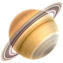
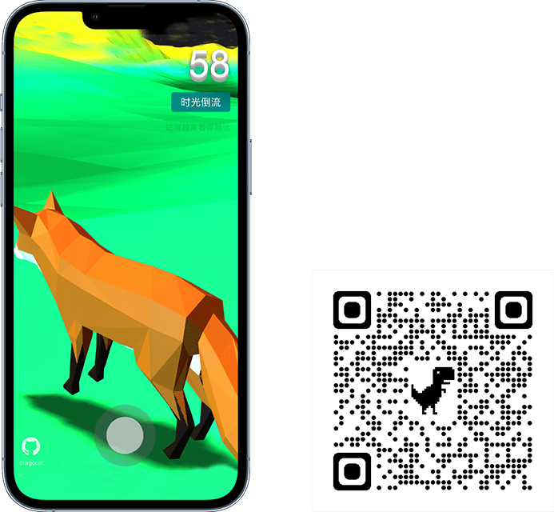
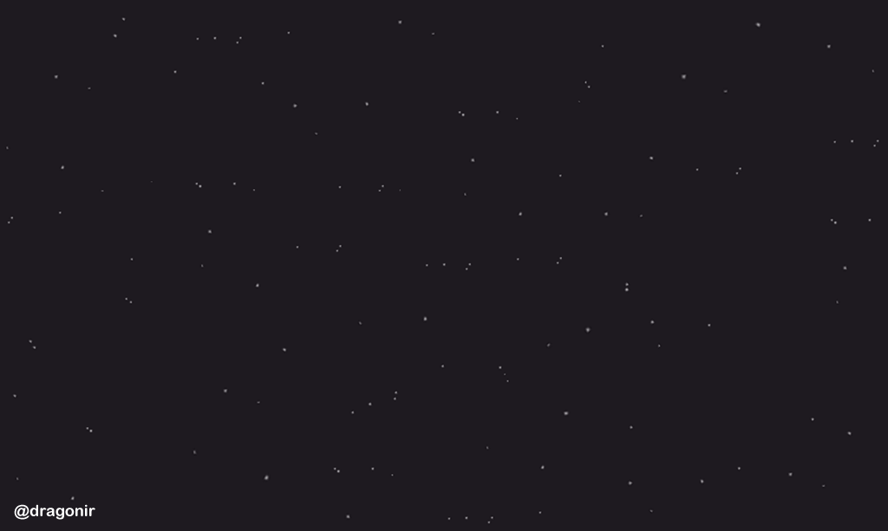
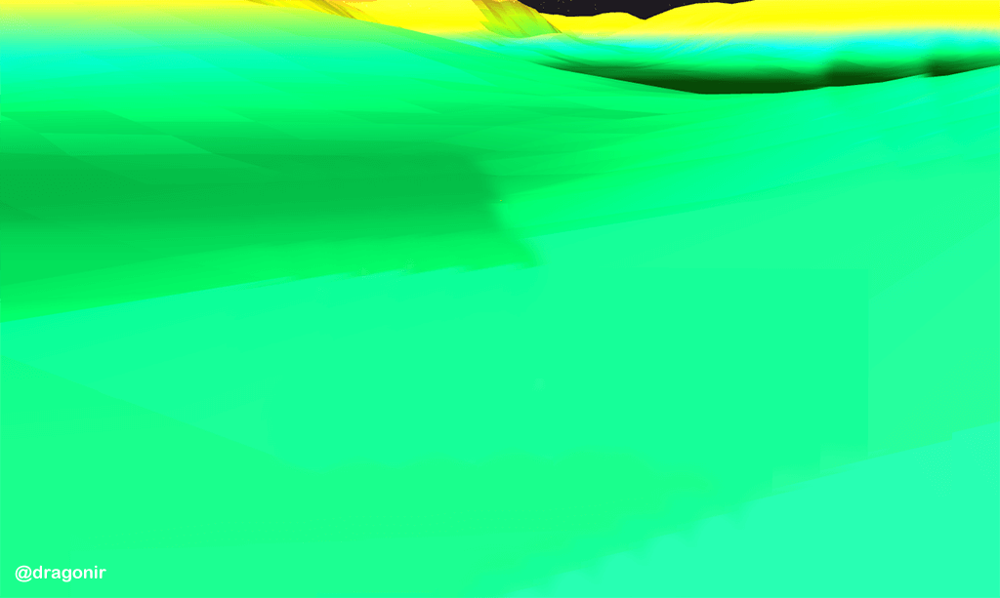
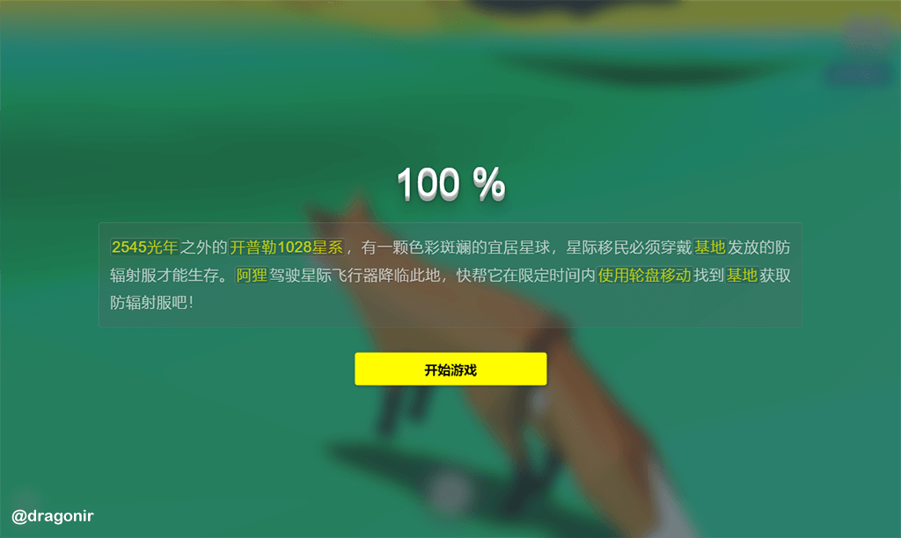
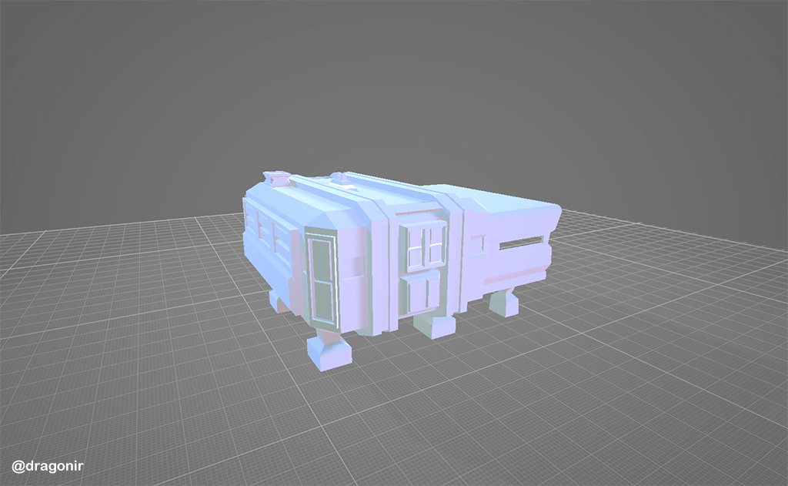
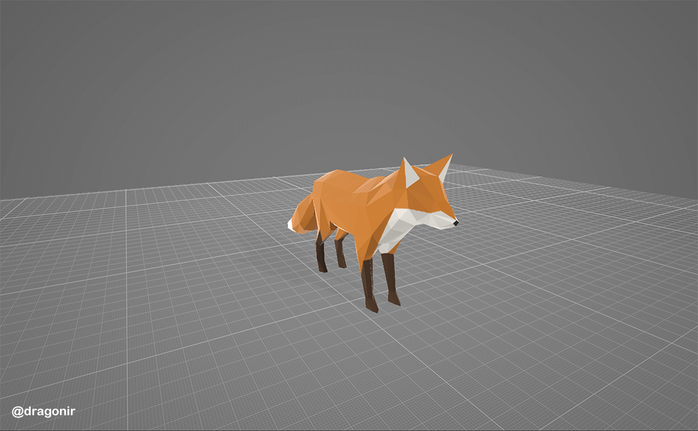
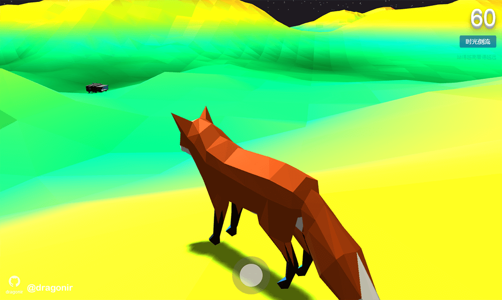
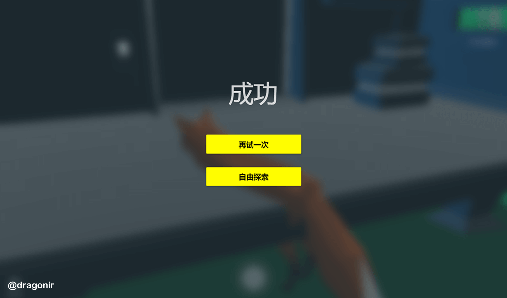

# Three.js 实现3D开放世界小游戏：阿狸的多元宇宙 🦊


> 声明：本文涉及图文和模型素材仅用于个人学习、研究和欣赏，请勿二次修改、非法传播、转载、出版、商用、及进行其他获利行为。

## 背景

> **2545光年**之外的**开普勒1028星系**，有一颗色彩斑斓的宜居星球，星际移民必须穿戴**基地**发放的防辐射服才能生存。**阿狸**驾驶星际飞行器降临此地，快帮它在限定时间内使用**轮盘**移动**找到基地**获取防辐射服吧！



本文使用 `Three.js + React + CANNON` 技术栈，实现通过滑动屏幕控制模型在 `3D` 世界里运动的 `Low Poly` 低多边形风格小游戏。本文主要涉及到的知识点包括：* `Three.js` 阴影类型、创建粒子系统、`cannon.js` 基本用法、使用 `cannon.js` 高度场 `Heightfield` 创建地形、通过轮盘移动控制模型动画等。

## 效果

* **游戏玩法**：页面加载完成后，点击**开始游戏**按钮，然后通过操作屏幕底部轮盘来移动阿狸 `🦊`，在倒计时限定时间内找到基地 `🏠`。
* **主线任务**：限定时间内找到庇护所。
* **支线任务**：自由探索开放世界。



**在线预览**：

* `👀` 地址：<https://3d-eosin.vercel.app/#/metaverse>

已适配:

* `💻` `PC` 端
* `📱` 移动端

> `🚩` 小提示：站得越高看得越远，隐隐约约听说基地位于初始位置的**西面**，开始时应该向左前方前进哦？

## 设计

游戏流程如下图所示，页面加载完成后点击开始按钮，然后在限定时间内通过控制页面滑轮移动模型，找到目标基地所在的位置。寻找成功或失败都会显示结果页，结果上面有两个按钮**再试一次**和**自由探索**，点击**再试一次**时间会重置，然后重新回到起点开始倒计时。点击**自由探索**则不在计时，玩家可以在 `3D` 开放世界里操作模型自由探索。同时，游戏内页面也提供一个**时光倒流**按钮，它的作用是玩家可以在失败前自己手动重置倒计时 `⏳`，重新回到起点开始游戏。


## 实现

### 加载资源

加载开发所需的必备资源：`GLTFLoader` 用于加载狐狸 `🦊` 和基地 `🏠` 模型、`CANNON` 是用于创建 `3D` 世界的物理引擎；`CannonHelper` 是对 `CANNON` 一些使用方法的封装；`JoyStick` 用于创建滑动屏幕控制模型的滚轮。

```js
import * as THREE from 'three';
import { GLTFLoader } from 'three/examples/jsm/loaders/GLTFLoader';
import CANNON from 'cannon';
import CannonHelper from './scripts/CannonHelper';
import JoyStick from './scripts/JoyStick';
```

### 页面结构

页面结构比较简单，`.webgl` 用于渲染 `WEBGL`；`.tool` 是游戏内的工具栏，用于重置游戏和显示一些提示语；`.loading` 是游戏加载页面，用来显示游戏加载进度、介绍游戏规则、显示游戏开始按钮；`.result` 是游戏结果页面，用于显示游戏成功或失败结果，并提供**再试一次**和**自由探索**两个按钮 `🔘`。

```js
(<div id="metaverse">
  <canvas className='webgl'></canvas>
  <div className='tool'>
    <div className='countdown'>{ this.state.countdown }</div>
    <button className='reset_button' onClick={this.resetGame}>时光倒流</button>
    <p className='hint'>站得越高看得越远</p>
  </div>
  { this.state.showLoading ? (<div className='loading'>
    <div className='box'>
      <p className='progress'>{this.state.loadingProcess} %</p>
      <p className='description'>游戏描述</p>
      <button className='start_button' style={{'visibility': this.state.loadingProcess === 100 ? 'visible' : 'hidden'}} onClick={this.startGame}>开始游戏</button>
    </div>
  </div>) : '' }
  { this.state.showResult ? (<div className='result'>
    <div className='box'>
      <p className='text'>{ this.state.resultText }</p>
      <button className='button' onClick={this.resetGame}>再试一次</button>
      <button className='button' onClick={this.discover}>自由探索</button>
    </div>
  </div>) : '' }
</div>)
```

### 数据初始化

数据变量包括加载进度、是否显示加载页面、是否显示结果页、结果页文案、倒计时、是否开启自由探索等。

```js
state = {
  loadingProcess: 0,
  showLoading: true,
  showResult: false,
  resultText: '失败',
  countdown: 60,
  freeDiscover: false
}
```

### 场景初始化

初始化场景、相机、光源。

```js
const renderer = new THREE.WebGLRenderer({
  canvas: document.querySelector('canvas.webgl'),
  antialias: true,
  alpha: true
});
renderer.setSize(window.innerWidth, window.innerHeight);
renderer.setPixelRatio(Math.min(window.devicePixelRatio, 2));
renderer.shadowMap.enabled = true;
renderer.shadowMap.type = THREE.PCFSoftShadowMap;
const scene = new THREE.Scene();
// 添加主相机
const camera = new THREE.PerspectiveCamera(45, window.innerWidth / window.innerHeight, .01, 100000);
camera.position.set(1, 1, -1);
camera.lookAt(scene.position);
// 添加环境光
const ambientLight = new THREE.AmbientLight(0xffffff, .4);
scene.add(ambientLight)
// 添加平行光
var light = new THREE.DirectionalLight(0xffffff, 1);
light.position.set(1, 1, 1).normalize();
scene.add(light);
```

#### `💡` Three.js 阴影类型

本文使用了 `THREE.PCFSoftShadowMap` 以开启效果更加柔和的阴影，`Three.js` 提供以下几种阴影类型：

* `THREE.BasicShadowMap`：提供未经过滤的阴影贴图，性能最快，但质量最低。
* `THREE.PCFShadowMap`：使用 `Percentage-Closer Filtering (PCF)` 算法过滤阴影贴图，是默认类型。
* `THREE.PCFSoftShadowMap`：使用 `PCF` 算法过滤的更加柔和的阴影贴图，尤其是在使用低分辨率阴影贴图时。
* `THREE.VSMShadowMap`：使用方差阴影贴图 `VSM` 算法过滤的阴影贴图。 使用 `VSMShadowMap` 时，所有阴影接收者也会投射阴影。

### 创建世界

使用 `Cannon.js` 初始化物理世界。

```js
// 初始化物理世界
const world = new CANNON.World();
// 在多个步骤的任意轴上测试刚体的碰撞
world.broadphase = new CANNON.SAPBroadphase(world);
// 设置物理世界的重力为沿y轴向上-10米每二次方秒
world.gravity.set(0, -10, 0);
// 创建默认联系材质
world.defaultContactMaterial.friction = 0;
const groundMaterial = new CANNON.Material("groundMaterial");
const wheelMaterial = new CANNON.Material("wheelMaterial");
const wheelGroundContactMaterial = new CANNON.ContactMaterial(wheelMaterial, groundMaterial, {
  // 摩擦系数
  friction: 0,
  // 恢复系数
  restitution: 0,
  // 接触刚度
  contactEquationStiffness: 1000
});
world.addContactMaterial(wheelGroundContactMaterial);
```

#### `💡` Cannon.js

`Cannon.js` 是用 `JavaScript` 实现的物理引擎库，可以与任何支持浏览器的渲染或游戏引擎，可以用于模拟刚体，实现3D世界中更加真实的物理形式的移动和交互。更多 `Cannon.js` 相关 `API` 文档和示例可以参考文章末尾链接。

### 创建星空

创建 `1000` 个粒子用于模型星空 `✨`，并将它们添加到场景中。本示例中通过着色器形式创建粒子，这样更有利于 `GPU` 渲染效率。

```js
const textureLoader = new THREE.TextureLoader();
const shaderPoint = THREE.ShaderLib.points;
const uniforms = THREE.UniformsUtils.clone(shaderPoint.uniforms);
uniforms.map.value = textureLoader.load(snowflakeTexture);
for (let i = 0; i < 1000; i++) {
  sparkGeometry.vertices.push(new THREE.Vector3());
}
const sparks = new THREE.Points(new THREE.Geometry(), new THREE.PointsMaterial({
  size: 2,
  color: new THREE.Color(0xffffff),
  map: uniforms.map.value,
  blending: THREE.AdditiveBlending,
  depthWrite: false,
  transparent: true,
  opacity: 0.75
}));
sparks.scale.set(1, 1, 1);
sparks.geometry.vertices.map(spark => {
  spark.y = randnum(30, 40);
  spark.x = randnum(-500, 500);
  spark.z = randnum(-500, 500);
  return true;
});
scene.add(sparks);
```



### 创建地形

通过 `CANNON.Heightfield` 高度场创建 `128 x 128 x 60` 可视化渐变色地形。地形的凹凸起伏状态是通过以下高度图 `HeightMap` 实现，它是一张黑白图片，通过像素点的颜色深浅来记录高度信息，可通过文章末尾提供的链接在线生成随机高度图。地形生成完成并将它添加到世界中，然后在 `animate` 方法中页面重绘时调用 `check` 方法，用于检测和更新模型在地形上的位置。


```js
const cannonHelper = new CannonHelper(scene);
var sizeX = 128, sizeY = 128, minHeight = 0, maxHeight = 60, check = null;
Promise.all([
  // 加载高度图
  img2matrix.fromUrl(heightMapImage, sizeX, sizeY, minHeight, maxHeight)(),
]).then(function (data) {
  var matrix = data[0];
  // 地形体
  const terrainBody = new CANNON.Body({ mass: 0 });
  // 地形形状
  const terrainShape = new CANNON.Heightfield(matrix, { elementSize: 10 });
  terrainBody.addShape(terrainShape);
  // 地形位置
  terrainBody.position.set(-sizeX * terrainShape.elementSize / 2, -10, sizeY * terrainShape.elementSize / 2);
  // 设置从轴角度
  terrainBody.quaternion.setFromAxisAngle(new CANNON.Vec3(1, 0, 0), -Math.PI / 2);
  world.add(terrainBody);
  // 将生成的地形刚体可视化
  cannonHelper.addVisual(terrainBody, 'landscape');
  var raycastHelperGeometry = new THREE.CylinderGeometry(0, 1, 5, 1.5);
  raycastHelperGeometry.translate(0, 0, 0);
  raycastHelperGeometry.rotateX(Math.PI / 2);
  var raycastHelperMesh = new THREE.Mesh(raycastHelperGeometry, new THREE.MeshNormalMaterial());
  scene.add(raycastHelperMesh);
  // 使用 Raycaster检测并更新模型在地形上的位置
  check = () => {
    var raycaster = new THREE.Raycaster(target.position, new THREE.Vector3(0, -1, 0));
    var intersects = raycaster.intersectObject(terrainBody.threemesh.children[0]);
    if (intersects.length > 0) {
      raycastHelperMesh.position.set(0, 0, 0);
      raycastHelperMesh.lookAt(intersects[0].face.normal);
      raycastHelperMesh.position.copy(intersects[0].point);
    }
    target.position.y = intersects && intersects[0] ? intersects[0].point.y + 0.1 : 30;
    var raycaster2 = new THREE.Raycaster(shelterLocation.position, new THREE.Vector3(0, -1, 0));
    var intersects2 = raycaster2.intersectObject(terrainBody.threemesh.children[0]);
    shelterLocation.position.y = intersects2 && intersects2[0] ? intersects2[0].point.y + .5 : 30;
    shelterLight.position.y = shelterLocation.position.y + 50;
    shelterLight.position.x = shelterLocation.position.x + 5
    shelterLight.position.z = shelterLocation.position.z;
  }
});
```

根据高度图数据信息创建地形网格。

```js
// ...
var geometry = new THREE.Geometry();
var v0 = new CANNON.Vec3(), v1 = new CANNON.Vec3(), v2 = new CANNON.Vec3();
for (let xi = 0; xi < shape.data.length - 1; xi++) {
  for (let yi = 0; yi < shape.data[xi].length - 1; yi++) {
    for (let k = 0; k < 2; k++) {
      shape.getConvexTrianglePillar(xi, yi, k === 0);
      v0.copy(shape.pillarConvex.vertices[0]);
      v1.copy(shape.pillarConvex.vertices[1]);
      v2.copy(shape.pillarConvex.vertices[2]);
      v0.vadd(shape.pillarOffset, v0);
      v1.vadd(shape.pillarOffset, v1);
      v2.vadd(shape.pillarOffset, v2);
      geometry.vertices.push(
        new THREE.Vector3(v0.x, v0.y, v0.z),
        new THREE.Vector3(v1.x, v1.y, v1.z),
        new THREE.Vector3(v2.x, v2.y, v2.z)
      );
      var i = geometry.vertices.length - 3;
      geometry.faces.push(new THREE.Face3(i, i + 1, i + 2));
    }
  }
}
```



#### `💡` CANNON.Heightfield

本示例中凹凸不平的地形是通过 `CANNON.Heightfield` 实现的，它是 `Cannon.js` 物理引擎的高度场。在物理学中把**某个物理量在空间中一个区域内的分布**称为**场**，高度场就是与高度相关的场。`Heightfield` 的高度就是关于两个变量的函数，可以表达为 `HEIGHT(i,j)`。

```js
Heightfield(data, options)
```

* `data` 是一个 `y值` 数组，将用于构建地形。
* `options` 是一个配置项，有三个可配置参数：
  * `minValue` 是数据数组中数据点的最小值。如果未给出，将自动计算。
  * `maxValue` 最大值。
  * `elementSize` 是 `x轴` 方向上数据点之间的世界间距。

### 加载进度管理

使用 `LoadingManager` 管理加载进度，当页面模型加载完成之后，加载进度页面显示**开始游戏菜单**。

```js
const loadingManager = new THREE.LoadingManager();
loadingManager.onProgress = async (url, loaded, total) => {
  this.setState({ loadingProcess: Math.floor(loaded / total * 100) });
};
```



### 创建基地模型

加载基地模型 `🏠` 前先创建一个 `shelterLocation` 网格用来放置基地模型，该网格对象还用于后续地形检测。然后使用 `GLTFLoader` 加载基地模型，然后把它添加到 `shelterLocation` 网格上。最后添加一个 `PointLight` `💡` 给基地模型添加彩色点光源，添加一个 `DirectionalLight` `💡` 用于生成阴影。

```js
const shelterGeometry = new THREE.BoxBufferGeometry(0.15, 2, 0.15);
const shelterLocation = new THREE.Mesh(shelterGeometry, new THREE.MeshNormalMaterial({
  transparent: true,
  opacity: 0
}));
shelterLocation.position.set(this.shelterPosition.x, this.shelterPosition.y, this.shelterPosition.z);
shelterLocation.rotateY(Math.PI);
scene.add(shelterLocation);
// 加载模型
gltfLoader.load(Shelter, mesh => {
  mesh.scene.traverse(child => {
    child.castShadow = true;
  });
  mesh.scene.scale.set(5, 5, 5);
  mesh.scene.position.y = -.5;
  shelterLocation.add(mesh.scene)
});
// 添加光源
const shelterPointLight = new THREE.PointLight(0x1089ff, 2);
shelterPointLight.position.set(0, 0, 0);
shelterLocation.add(shelterPointLight);
const shelterLight = new THREE.DirectionalLight(0xffffff, 0);
shelterLight.position.set(0, 0, 0);
shelterLight.castShadow = true;
shelterLight.target = shelterLocation;
scene.add(shelterLight);
```



### 创建阿狸模型

狐狸 `🦊` 模型的加载也是类似的，需要先创建一个目标网格，后续用于地形检测，然后把狐狸 `🦊` 模型添加到目标网格上。狐狸 `🦊` 模型完成加载后，需要保存它的 `clip1`、 `clip1` 两种动画效果，后续需要通过判断轮盘的移动状态来判断播放哪种动画。最后添加一个 `DirectionalLight` `💡` 光源来产生阴影。

```js
var geometry = new THREE.BoxBufferGeometry(.5, 1, .5);
geometry.applyMatrix4(new THREE.Matrix4().makeTranslation(0, .5, 0));
const target = new THREE.Mesh(geometry, new THREE.MeshNormalMaterial({
  transparent: true,
  opacity: 0
}));
scene.add(target);

var mixers = [], clip1, clip2;
const gltfLoader = new GLTFLoader(loadingManager);
gltfLoader.load(foxModel, mesh => {
  mesh.scene.traverse(child => {
    if (child.isMesh) {
      child.castShadow = true;
      child.material.side = THREE.DoubleSide;
    }
  });
  var player = mesh.scene;
  player.position.set(this.playPosition.x, this.playPosition.y, this.playPosition.z);
  player.scale.set(.008, .008, .008);
  target.add(player);
  var mixer = new THREE.AnimationMixer(player);
  clip1 = mixer.clipAction(mesh.animations[0]);
  clip2 = mixer.clipAction(mesh.animations[1]);
  clip2.timeScale = 1.6;
  mixers.push(mixer);
});

const directionalLight = new THREE.DirectionalLight(new THREE.Color(0xffffff), .5);
directionalLight.position.set(0, 1, 0);
directionalLight.castShadow = true;
directionalLight.target = target;
target.add(directionalLight);
```



### 控制阿狸运动

使用轮盘控制器移动阿狸 `🦊` 模型时，实时更新模型的方向，若轮盘产生位移，更新模型位移并播放奔跑动画，否则播放禁止动画。同时根据模型目标的位置，实时更新相机 `📷` 的位置，生成第三人称视角。轮盘移动控制模型移动功能是通过引入 `JoyStick` 类来实现，它的主要实现原理是监听鼠标或点触位置，然后通过计算映射到模型位置变化上。

```js
var setup = { forward: 0, turn: 0 };
new JoyStick({ onMove: (forward, turn) => {
  setup.forward = forward;
  setup.turn = -turn;
}});
const updateDrive = (forward = setup.forward, turn = setup.turn) => {
  let maxSteerVal = 0.05;
  let maxForce = .15;
  let force = maxForce * forward;
  let steer = maxSteerVal * turn;
  if (forward !== 0) {
    target.translateZ(force);
    clip2 && clip2.play();
    clip1 && clip1.stop();
  } else {
    clip2 && clip2.stop();
    clip1 && clip1.play();
  }
  target.rotateY(steer);
}
// 生成第三人称视角
const followCamera = new THREE.Object3D();
followCamera.position.copy(camera.position);
scene.add(followCamera);
followCamera.parent = target;
const updateCamera = () => {
  if (followCamera) {
    camera.position.lerp(followCamera.getWorldPosition(new THREE.Vector3()), 0.1);
    camera.lookAt(target.position.x, target.position.y + .5, target.position.z);
  }
}
```

> `🚩` 轮盘控制器 `JoyStick` 类具体实现可参考文章末尾 `Codepen` 链接。

### 动画更新

在页面重绘动画中，更新相机、模型状态、`Cannon` 世界、场景渲染等。

```js
var clock = new THREE.Clock();
var lastTime;
var fixedTimeStep = 1.0 / 60.0;
const animate = () => {
  updateCamera();
  updateDrive();
  let delta = clock.getDelta();
  mixers.map(x => x.update(delta));
  let now = Date.now();
  lastTime === undefined && (lastTime = now);
  let dt = (Date.now() - lastTime) / 1000.0;
  lastTime = now;
  world.step(fixedTimeStep, dt);
  cannonHelper.updateBodies(world);
  check && check();
  renderer.render(scene, camera);
  requestAnimationFrame(animate);
};
```

### 页面缩放适配

页面产生缩放时，更新渲染场景和相机。

```js
window.addEventListener('resize', () => {
  var width = window.innerWidth, height = window.innerHeight;
  renderer.setSize(width, height);
  camera.aspect = width / height;
  camera.updateProjectionMatrix();
}, false);
```

到此为止，游戏三维世界已经全部实现完毕了。



### 添加游戏逻辑

根据前面的游戏流程设计，现在添加游戏逻辑，开始游戏时重置数据并开始 `60s` 倒计时 `⏳` ；重置游戏时将阿狸 `🦊` 位置、方向及相机位置设置为初始状态；自由探索时开启自由探索状态，并清除倒计时。

```js
startGame = () => {
  this.setState({
    showLoading : false,
    showResult: false,
    countdown: 60,
    resultText: '失败',
    freeDiscover: false
  },() => {
    this.interval = setInterval(() => {
      if (this.state.countdown > 0) {
        this.setState({
          countdown: --this.state.countdown
        });
      } else {
        clearInterval(this.interval)
        this.setState({
          showResult: true
        });
      }
    }, 1000);
  });
}
resetGame = () => {
  this.player.position.set(this.playPosition.x, this.playPosition.y, this.playPosition.z);
  this.target.rotation.set(0, 0, 0);
  this.target.position.set(0, 0, 0);
  this.camera.position.set(1, 1, -1);
  this.startGame();
}
discover = () => {
  this.setState({
    freeDiscover: true,
    showResult: false,
    countdown: 60
  }, () => {
    clearInterval(this.interval);
  });
}
```

### 毛玻璃效果

`Loading` 页面、结果页面以及回到过去按钮都采用了**毛玻璃效果**样式，通过以下几行样式代码，即可实现惊艳的毛玻璃。 `✨`

```stylus
background rgba(0, 67, 170, .5)
filter drop-shadow(0px 1px 1px rgba(0, 0, 0, .25))
backdrop-filter blur(10px)
```



## 总结

本文涉及到的新知识点主要包括：

* `Three.js` 阴影类型
* 创建粒子系统
* `cannon.js` 基本用法
* 使用 `cannon.js` 高度场 `Heightfield` 创建地形
* 通过轮盘移动控制模型动画

> 想了解场景初始化、光照、阴影、基础几何体、网格、材质及其他**Three.js**的相关知识，可阅读我往期文章。**转载请注明原文地址和作者**。如果觉得文章对你有帮助，不要忘了**一键三连哦 👍**。

## 附录

* [1]. [Three.js 火焰效果实现艾尔登法环动态logo](https://juejin.cn/post/7077726955528781832)
* [2]. [Three.js 实现神奇的3D文字悬浮效果](https://juejin.cn/post/7072899771819622413)
* [3]. [Three.js 实现让二维图片具有3D效果](https://juejin.cn/post/7067344398912061454)
* [4]. [Three.js 实现2022冬奥主题3D趣味页面，冰墩墩 🐼](https://juejin.cn/post/7060292943608807460)
* [5]. [Three.js 制作一个专属3D奖牌](https://juejin.cn/post/7055079293247815711)
* [6]. [Three.js 实现虎年春节3D创意页面](https://juejin.cn/post/7051745314914435102)
* [7]. [Three.js 实现脸书元宇宙3D动态Logo](https://juejin.cn/post/7031893833163997220)
* [8]. [Three.js 实现3D全景侦探小游戏](https://juejin.cn/post/7042298964468564005)
* [9]. [Three.js 实现炫酷的酸性风格3D页面](https://juejin.cn/post/7012996721693163528)

## 参考资料

* [1] [threejs.org](https://threejs.org/)
* [2] [cannonjs.org](http://www.cannonjs.org/)
* [3] [heightmap-generator](http://heightmap-generator.com/)
* [4] [three.js cannon.js物理引擎之Heightfield](https://www.mrguo.link/article?id=53)
* [5] [Joggin' version 0.1](https://codepen.io/b29/pen/JjyJWEg)
