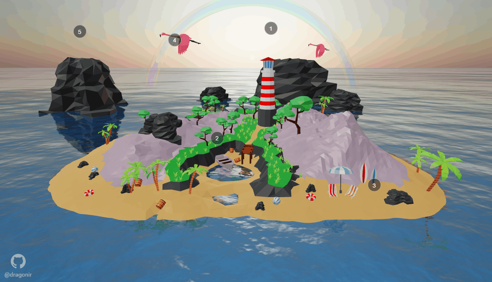
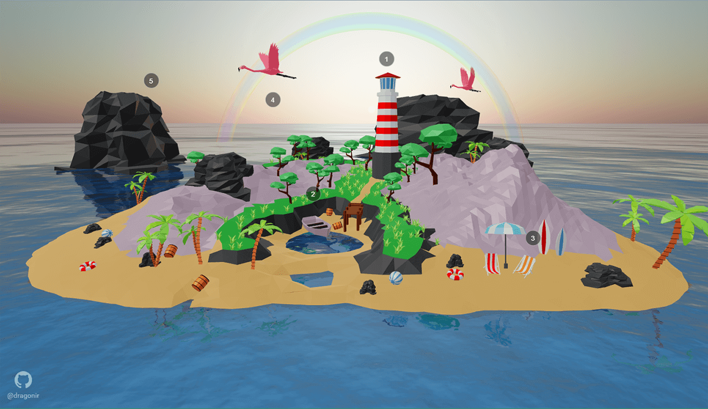
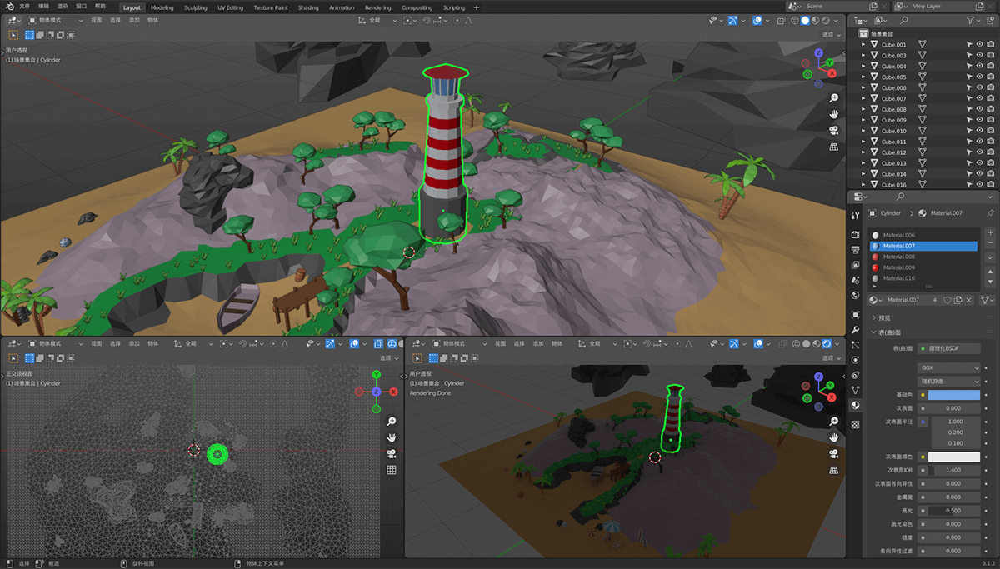
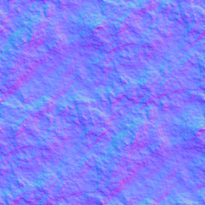
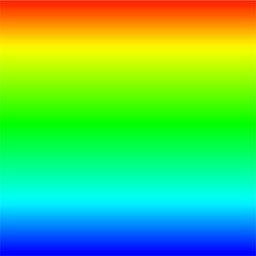
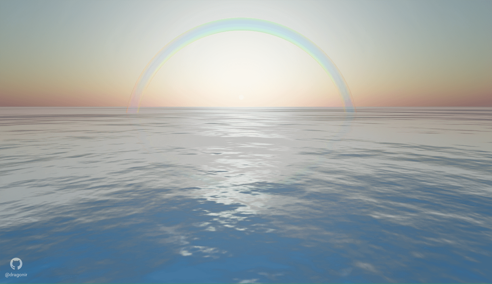
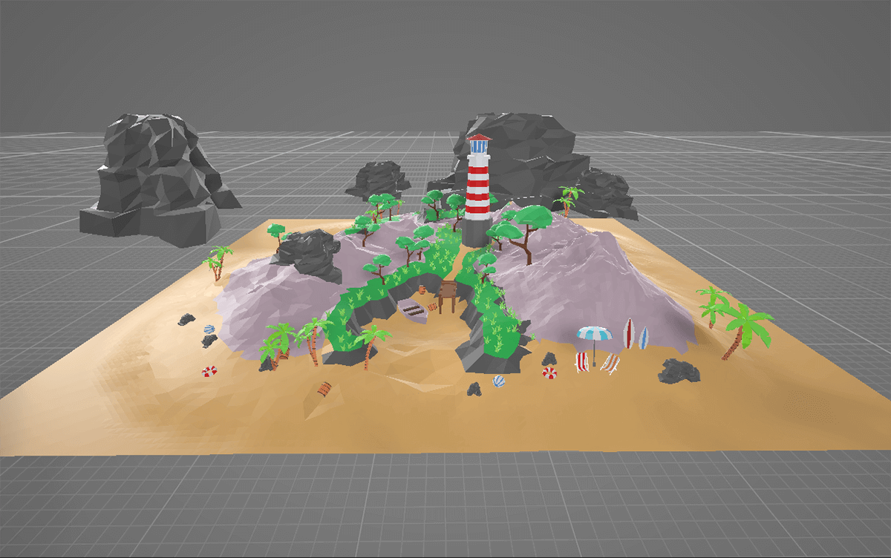
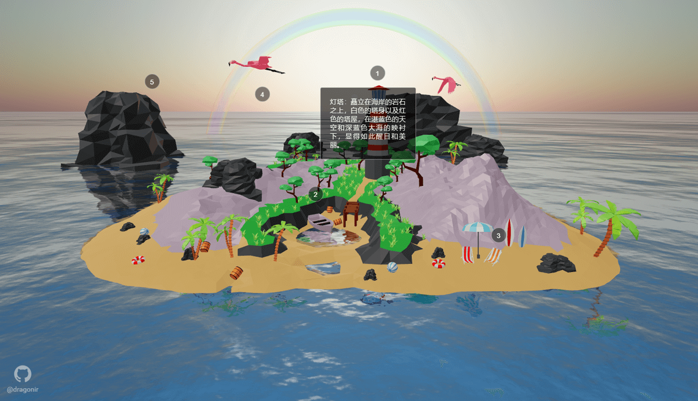

# Three.js 打造专属自己的缤纷夏日3D梦中情岛

> 声明：本文涉及图文和模型素材仅用于个人学习、研究和欣赏，请勿二次修改、非法传播、转载、出版、商用、及进行其他获利行为。



## 背景

深居内陆的人们，大概每个人都有过大海之梦吧。夏日傍晚在沙滩漫步奔跑；或是在海上冲浪游泳；或是在海岛游玩探险；亦或静待日出日落……本文使用 `React + Three.js` 技术栈，实现 `3D` 海洋和岛屿，让我们在这个夏天通过这个页面共赴大海之约。

## 效果



* `👁‍🗨` 在线预览地址1：<https://3d-eosin.vercel.app/#/ocean>
* `👁‍🗨` 在线预览地址2：<https://dragonir.github.io/3d/#/ocean>

## 实现

### 👨‍🎨 素材准备

开发之前，需要准备页面所需的素材，本文用到的海岛素材是在 [sketchfab.com](https://sketchfab.com/feed) 找的免费素材。下载好素材之后，在 `Blender` 中打开，按自己的想法调整模型的颜色、材质、大小比例、角度、位置等信息，删减不需要的模块、缩减面数以压缩模型体积，最后删除相机、光照、`UV`、动画等多余信息，只导出模型网格备用。



### 📦 资源引入

首先，引入开发所需的必备资源，`OrbitControls` 用于镜头轨道控制；`GLTFLoader` 用于加载 `gltf` 格式模型；`Water` 是 `Three.js` 内置的一个类，可以生成类似水的效果；`Sky` 可以生成天空效果；`TWEEN` 用来生成补间动画；`Animations` 是对 `TWEEN` 控制镜头补间动画方法的封装；`waterTexture` 、`flamingoModel`、`islandModel` 三者分别是水的法向贴图、飞鸟模型、海岛模型；`vertexShader` 和 `fragmentShader` 是用于生成彩虹的 `Shader` 着色器。

```js
import * as THREE from "three";
import { OrbitControls } from "three/examples/jsm/controls/OrbitControls";
import { GLTFLoader } from "three/examples/jsm/loaders/GLTFLoader";
import { Water } from 'three/examples/jsm/objects/Water';
import { Sky } from 'three/examples/jsm/objects/Sky';
import { TWEEN } from "three/examples/jsm/libs/tween.module.min";
import Animations from '@/assets/utils/animations';
import waterTexture from '@/containers/Ocean/images/waternormals.jpg';
import islandModel from '@/containers/Ocean/models/island.glb';
import flamingoModel from '@/containers/Ocean/models/flamingo.glb';
import vertexShader from '@/containers/Ocean/shaders/rainbow/vertex.glsl';
import fragmentShader from '@/containers/Ocean/shaders/rainbow/fragment.glsl';
```

### 📃 页面结构

页面主要由3部分构成：`canvas.webgl` 用于渲染WEBGL场景；`div.loading` 用于模型加载完成前显示加载进度；`div.point` 用于添加交互点，省略部分是其他几个交互点信息。

```js
render () {
  return (
    <div className='ocean'>
      <canvas className='webgl'></canvas>
      {this.state.loadingProcess === 100 ? '' : (
        <div className='loading'>
          <span className='progress'>{this.state.loadingProcess} %</span>
        </div>
      )}
      <div className="point point-0">
        <div className="label label-0">1</div>
        <div className="text">灯塔：矗立在海岸的岩石之上，白色的塔身以及红色的塔屋，在湛蓝色的天空和深蓝色大海的映衬下，显得如此醒目和美丽。</div>
      </div>
      // ...
    </div>
  )
}
```

### 🌏 场景初始化

在这部分，先定义好需要的状态值，`loadingProcess` 用于显示加载进度。

```js
state = {
  loadingProcess: 0
}
```

定义一些全局变量和参数，初始化场景、相机、镜头轨道控制器、灯光、页面缩放监听等。

```js
const clock = new THREE.Clock();
const raycaster = new THREE.Raycaster()
const sizes = {
  width: window.innerWidth,
  height: window.innerHeight
}
const renderer = new THREE.WebGLRenderer({
  canvas: document.querySelector('canvas.webgl'),
  antialias: true
});
renderer.setPixelRatio(Math.min(window.devicePixelRatio, 2))
renderer.setSize(sizes.width, sizes.height);
// 设置渲染效果
renderer.toneMapping = THREE.ACESFilmicToneMapping;
// 创建场景
const scene = new THREE.Scene();
// 创建相机
const camera = new THREE.PerspectiveCamera(55, sizes.width / sizes.height, 1, 20000);
camera.position.set(0, 600, 1600);
// 添加镜头轨道控制器
const controls = new OrbitControls(camera, renderer.domElement);
controls.target.set(0, 0, 0);
controls.enableDamping = true;
controls.enablePan = false;
controls.maxPolarAngle = 1.5;
controls.minDistance = 50;
controls.maxDistance = 1200;
// 添加环境光
const ambientLight = new THREE.AmbientLight(0xffffff, .8);
scene.add(ambientLight);
// 添加平行光
const dirLight = new THREE.DirectionalLight(0xffffff, 1);
dirLight.color.setHSL(.1, 1, .95);
dirLight.position.set(-1, 1.75, 1);
dirLight.position.multiplyScalar(30);
scene.add(dirLight);
// 页面缩放监听并重新更新场景和相机
window.addEventListener('resize', () => {
  camera.aspect = window.innerWidth / window.innerHeight;
  camera.updateProjectionMatrix();
  renderer.setSize(window.innerWidth, window.innerHeight);
}, false);
```

#### `💡` Tone Mapping

可以注意到，本文使用了 `renderer.toneMapping = THREE.ACESFilmicToneMapping` 来设置页面渲染效果。目前 `Three.js` 中有以下几种 `Tone Mapping` 值，它们定义了 `WebGLRenderer` 的 `toneMapping` 属性，用于在近似标准计算机显示器或移动设备的低动态范围 `LDR` 屏幕上展示高动态范围 `HDR` 外观。大家可以修改不同的值看看渲染效果有何不同。

* `THREE.NoToneMapping`
* `THREE.LinearToneMapping`
* `THREE.ReinhardToneMapping`
* `THREE.CineonToneMapping`
* `THREE.ACESFilmicToneMapping`

### 🌊 海

使用Three.js自带的Water类创建海洋，首先创建一个平面网格 `waterGeometry`，让后将它传递给 `Water`，并配置相关属性。



```js
const waterGeometry = new THREE.PlaneGeometry(10000, 10000);
const water = new Water(waterGeometry, {
  textureWidth: 512,
  textureHeight: 512,
  waterNormals: new THREE.TextureLoader().load(waterTexture,  texture => {
    texture.wrapS = texture.wrapT = THREE.RepeatWrapping;
  }),
  sunDirection: new THREE.Vector3(),
  sunColor: 0xffffff,
  waterColor: 0x0072ff,
  distortionScale: 4,
  fog: scene.fog !== undefined
});
water.rotation.x = - Math.PI / 2;
scene.add(water);
```

#### `💡` Water 类

参数说明：

* `textureWidth`：画布宽度
* `textureHeight`：画布高度
* `waterNormals`：法向量贴图
* `sunDirection`：阳光方向
* `sunColor`：阳光颜色
* `waterColor`：水颜色
* `distortionScale`：物体倒影分散度
* `fog`：雾
* `alpha`：透明度


### 🌞 空

接着，使用 `Three.js` 自带的天空类 `Sky` 创建天空，通过修改着色器参数设置天空样式，然后创建太阳。

```js
const sky = new Sky();
sky.scale.setScalar(10000);
scene.add(sky);
const skyUniforms = sky.material.uniforms;
skyUniforms['turbidity'].value = 20;
skyUniforms['rayleigh'].value = 2;
skyUniforms['mieCoefficient'].value = 0.005;
skyUniforms['mieDirectionalG'].value = 0.8;
// 太阳
const sun = new THREE.Vector3();
const pmremGenerator = new THREE.PMREMGenerator(renderer);
const phi = THREE.MathUtils.degToRad(88);
const theta = THREE.MathUtils.degToRad(180);
sun.setFromSphericalCoords(1, phi, theta);
sky.material.uniforms['sunPosition'].value.copy(sun);
water.material.uniforms['sunDirection'].value.copy(sun).normalize();
scene.environment = pmremGenerator.fromScene(sky).texture;
```

#### `💡` Sky 类

天空材质着色器变量说明：

* `turbidity` 浑浊度
* `rayleigh` 视觉效果就是傍晚晚霞的红光的深度
* `luminance` 视觉效果整体提亮或变暗
* `mieCoefficient` 散射系数
* `mieDirectionalG` 定向散射值


### 🌈 虹

首先，创建彩虹渐变效果的着色器 `Shader`, 然后使用着色器材质 `ShaderMaterial`， 创建圆环 `THREE.TorusGeometry` 并添加到场景中。

vertex.glsl

```glsl
varying vec2 vUV;
varying vec3 vNormal;

void main () {
  vUV = uv;
  vNormal = vec3(normal);
  gl_Position = projectionMatrix * modelViewMatrix * vec4(position, 1.0);
}
```

fragment.glsl

```glsl
varying vec2 vUV;
varying vec3 vNormal;

void main () {
  vec4 c = vec4(abs(vNormal) + vec3(vUV, 0.0), 0.1);
  gl_FragColor = c;
}
```

彩虹渐变着色器效果：



```js
const material = new THREE.ShaderMaterial({
  side: THREE.DoubleSide,
  transparent: true,
  uniforms: {},
  vertexShader: vertexShader,
  fragmentShader: fragmentShader
});
const geometry = new THREE.TorusGeometry(200, 10, 50, 100);
const torus = new THREE.Mesh(geometry, material);
torus.opacity = .1;
torus.position.set(0, -50, -400);
scene.add(torus);
```



#### `💡` Shader 着色器

WebGL 中记述了坐标变换的机制就叫做着色器 `Shader`，着色器又有处理几何图形顶点的 顶点着色器 和处理像素的 片段着色器 两种类型

##### 准备顶点着色器和片元着色器

着色器的添加有多种方法，最简单的方法就是把着色器记录在 `HTML` 中。该方法利用`HTML` 的 `script` 标签来实现，如：

顶点着色器：

```html
<script id="vshader" type="x-shader/x-vertex"></script>
```

片段着色器：

```html
<script id="fshader" type="x-shader/x-fragment"></script>
```

也可以像本文中一样，直接使用单独创建 `glsl` 格式文件引入。

##### 着色器的三个变量与运行方式

* `Uniforms`：是所有顶点都具有相同的值的变量。 比如灯光，雾，和阴影贴图就是被储存在 `uniforms` 中的数据。`uniforms` 可以通过顶点着色器和片元着色器来访问。
* `Attributes`：是与每个顶点关联的变量。例如，顶点位置，法线和顶点颜色都是存储在 `attributes` 中的数据。`attributes` 只可以在顶点着色器中访问。
* `Varyings`：是从顶点着色器传递到片元着色器的变量。对于每一个片元，每一个`varying` 的值将是相邻顶点值的平滑插值。

`顶点着色器` 首先运行，它接收 `attributes`， 计算每个单独顶点的位置，并将其他数据（`varyings`）传递给片元着色器。`片段着色器` 后运行，它设置渲染到屏幕的每个单独的片段的颜色。

#### `💡` ShaderMaterial 着色器材质

`Three.js` 所谓的材质对象 `Material` 本质上就是着色器代码和需要传递的 `uniform` 数据（光源、颜色、矩阵）。

很多时候想写一些特效，往往需要编写着色器代码 `GLSL`，如果有着色器语言基础，直接使用 `Three.js` 引擎的 `ShaderMaterial` 或 `RawShaderMaterial` `API` 编写就可以。在 `Three.js` 中想着色器传递数据不需要像 `WebGL` 中要使用`WebGL API` 来传递，`Three.js` 会自动处理。

* `RawShaderMaterial`: 和原生 `WebGL` 中一样，顶点着色器、片元着色器代码基本没有任何区别，不过顶点数据和 `uniform` 数据可以通过 `Three.js` 的API快速传递，要比使用 `WebGL` 原生的 `API` 与着色器变量绑定要方便得多。
* `ShaderMaterial`：`ShaderMaterial` 比 `RawShaderMaterial` 更方便些，着色器中的很多变量不用声明，`Three.js` 系统会自动帮你设置，比如顶点坐标变量、投影矩阵、视图矩阵等。

### 构造函数

```js
ShaderMaterial(parameters : Object)
```

`parameters`：(可选)用于定义材质外观的对象，具有一个或多个属性。 材质的任何属性都可以从此处传入(包括从 `Material` 继承的任何属性)。

常用属性：

* `attributes[Object]`：接受如下形式的对象，`{ attribute1: { value: []} }` 指定要传递给顶点着色器代码的 `attributes`；键为 `attribute` 修饰变量的名称，值也是对象格式，如 `{ value: [] }`， `value` 是固定名称，因为 `attribute` 相对于所有顶点，所以应该回传一个数组格式。只有 `bufferGeometry` 类型的能使用该属性。
* `.uniforms[Object]`：如下形式的对象：
`{ uniform1: { value: 1.0 }, uniform2: { value: 2.0 }}` 指定要传递给`shader` 代码的 `uniforms`；键为 `uniform` 的名称，值是如下形式：
`{ value: 1.0 }` 这里 `value` 是 `uniform` 的值。名称必须匹配着色器代码中  `uniform` 的 `name`，和 `GLSL` 代码中的定义一样。 注意，`uniforms` 逐帧被刷新，所以更新 `uniform` 值将立即更新 `GLSL` 代码中的相应值。
* `.fragmentShader[String]`：片元着色器的 `GLSL` 代码。这是 `shader` 程序的实际代码。在上面的例子中， `vertexShader` 和 `fragmentShader` 代码是从 `DOM` 中获取的； 它也可以作为一个字符串直接传递或者通过 `AJAX` 加载。
* `.vertexShader[String]`：顶点着色器的 `GLSL` 代码。这是 `shader` 程序的实际代码。 在上面的例子中，`vertexShader` 和 `fragmentShader` 代码是从 `DOM` 中获取的； 它也可以作为一个字符串直接传递或者通过 `AJAX` 加载。

### 🌴 岛

使用 `GLTFLoader` 加载岛屿模型并添加到场景中。



```js
const manager = new THREE.LoadingManager();
manager.onProgress = async(url, loaded, total) => {
  if (Math.floor(loaded / total * 100) === 100) {
    this.setState({ loadingProcess: Math.floor(loaded / total * 100) });
    Animations.animateCamera(camera, controls, { x: 0, y: 40, z: 140 }, { x: 0, y: 0, z: 0 }, 4000, () => {
      this.setState({ sceneReady: true });
    });
  } else {
    this.setState({ loadingProcess: Math.floor(loaded / total * 100) });
  }
};
const loader = new GLTFLoader(manager);
loader.load(islandModel, mesh => {
  mesh.scene.traverse(child => {
    if (child.isMesh) {
      child.material.metalness = .4;
      child.material.roughness = .6;
    }
  })
  mesh.scene.position.set(0, -2, 0);
  mesh.scene.scale.set(33, 33, 33);
  scene.add(mesh.scene);
});
```


### 🦅 鸟

使用 `GLTFLoader` 加载岛屿模型添加到场景中，获取模型自带的动画帧并进行播放，记得要在 `requestAnimationFrame` 中更新动画。可以使用 `clone` 方法在场景中添加多只飞鸟。


```js
loader.load(flamingoModel, gltf => {
  const mesh = gltf.scene.children[0];
  mesh.scale.set(.35, .35, .35);
  mesh.position.set(-100, 80, -300);
  mesh.rotation.y = - 1;
  mesh.castShadow = true;
  scene.add(mesh);
  const mixer = new THREE.AnimationMixer(mesh);
  mixer.clipAction(gltf.animations[0]).setDuration(1.2).play();
  this.mixers.push(mixer);
});
```


### 🖐 交互点

添加交互点，鼠标hover悬浮时显示提示语，点击交互点可以切换镜头角度，视角聚焦到交互点对应的位置 `📍` 上。

```js
const points = [
  {
    position: new THREE.Vector3(10, 46, 0),
    element: document.querySelector('.point-0')
  },
  // ...
];
document.querySelectorAll('.point').forEach(item => {
  item.addEventListener('click', event => {
    let className = event.target.classList[event.target.classList.length - 1];
    switch(className) {
      case 'label-0':
        Animations.animateCamera(camera, controls, { x: -15, y: 80, z: 60 }, { x: 0, y: 0, z: 0 }, 1600, () => {});
        break;
      // ...
    }
  }, false);
});
```



### 🎥 动画

在 `requestAnimationFrame` 中更新水、镜头轨道控制器、相机、`TWEEN`、交互点等动画。

```js
const animate = () => {
  requestAnimationFrame(animate);
  water.material.uniforms['time'].value += 1.0 / 60.0;
  controls && controls.update();
  const delta = clock.getDelta();
  this.mixers && this.mixers.forEach(item => {
    item.update(delta);
  });
  const timer = Date.now() * 0.0005;
  TWEEN && TWEEN.update();
  camera && (camera.position.y += Math.sin(timer) * .05);
  if (this.state.sceneReady) {
    // 遍历每个点
    for (const point of points) {
      // 获取2D屏幕位置
      const screenPosition = point.position.clone();
      screenPosition.project(camera);
      raycaster.setFromCamera(screenPosition, camera);
      const intersects = raycaster.intersectObjects(scene.children, true);
      if (intersects.length === 0) {
        // 未找到相交点，显示
        point.element.classList.add('visible');
      } else {
        // 找到相交点
        // 获取相交点的距离和点的距离
        const intersectionDistance = intersects[0].distance;
        const pointDistance = point.position.distanceTo(camera.position);
        // 相交点距离比点距离近，隐藏；相交点距离比点距离远，显示
        intersectionDistance < pointDistance ? point.element.classList.remove('visible') :  point.element.classList.add('visible');
      }
      const translateX = screenPosition.x * sizes.width * 0.5;
      const translateY = - screenPosition.y * sizes.height * 0.5;
      point.element.style.transform = `translateX(${translateX}px) translateY(${translateY}px)`;
    }
  }
  renderer.render(scene, camera);
}
animate();
}
```

#### `💡` Raycaster 检测遮挡

仔细观察，在上述 `👆` 更新交互点动画的方法中，通过 `raycaster` 射线来检查交互点是否被物体遮挡，如果被遮挡就隐藏交互点，否则显示交互点，大家可以通过旋转场景观察到这一效果。


## 总结

本文包含的新知识点主要包括：

* `Tone Mapping`
* `Water` 类
* `Sky` 类
* `Shader` 着色器
* `ShaderMaterial` 着色器材质
* `Raycaster` 检测遮挡

> 想了解其他前端知识或 `WEB 3D` 开发技术相关知识，可阅读我往期文章。**转载请注明原文地址和作者**。如果觉得文章对你有帮助，不要忘了**一键三连哦 👍**。

## 参考

* [1]. <https://threejs.org>

## 附录

* [1]. [📷 前端实现很哇塞的浏览器端扫码功能](https://juejin.cn/post/7018722520345870350)
* [2]. [🌏 前端瓦片地图加载之塞尔达传说旷野之息](https://juejin.cn/post/7007432493569671182)
* [3]. [😱 仅用CSS几步实现赛博朋克2077风格视觉效果](https://juejin.cn/post/6972759988632551460)
* `...`

[3D](https://juejin.cn/column/7049923956257587213)

* [1]. [🦊 Three.js 实现3D开放世界小游戏：阿狸的多元宇宙](https://juejin.cn/post/7081429595689320478)
* [2]. [🔥 Three.js 火焰效果实现艾尔登法环动态logo](https://juejin.cn/post/7077726955528781832)
* [3]. [🐼 Three.js 实现2022冬奥主题3D趣味页面，含冰墩墩](https://juejin.cn/post/7060292943608807460)
* `...`
