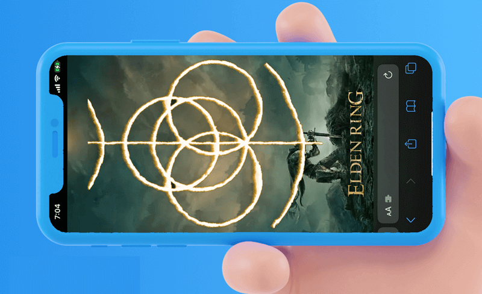
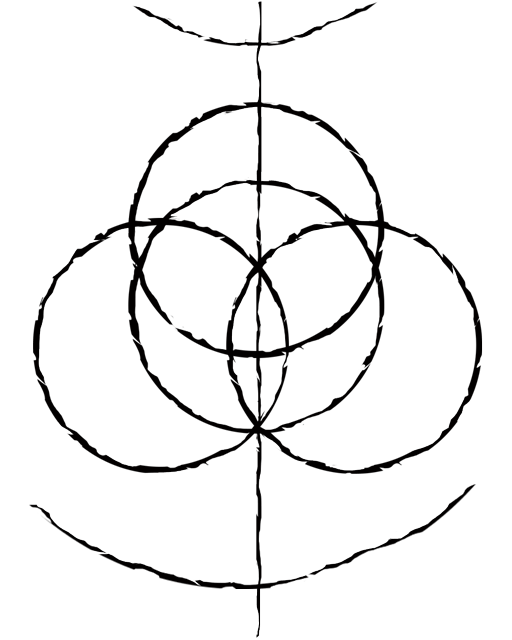

# Three.js 火焰效果实现艾尔登法环动态logo 🔥


## 背景

本文使用 `React + Three.js` 技术栈，实现基于 `Fire.js` 的艾尔登法环 `Logo` 火焰效果，本文中涉及到的知识点包括：`Fire.js` 基本使用方法。

## 效果



**在线预览**：

* `👀` 地址1：<https://3d-dragonir.vercel.app/#/ring>
* `👀` 地址2：<https://dragonir.github.io/3d/#/ring>

已适配:

* `💻` `PC` 端
* `📱` 移动端

## 实现

开始实现之前，先来了解一下 `Fire.js` 的基本使用方法。

### `💡 Fire.js`

`Threejs` 提供了一个可以实现火焰和烟雾效果的扩展包，通过引用这个包，通过设置某些参数实现需要的效果。**（已经从新版中移除）**

**火焰设置可选属性参数**：

* `color1`：内焰颜色
* `color2`：外焰颜色
* `color3`：烟雾颜色
* `colorBias`：颜色偏差
* `burnRate`：燃烧率
* `diffuse`：扩散
* `viscosity`：粘度
* `expansion`：膨胀
* `swirl`：旋转
* `drag`：拖拽
* `airSpeed`：空气速度
* `windX`：`X轴` 风向
* `windY`：`Y轴` 风向
* `speed`：火焰速度
* `massConservation`：质量守恒

常用方法：

* 添加资源：`addSource(u, v, radius, density, windX, windY)`
* 清除资源：`clearSources()`
* 设置贴图：`setSourceMap(texture)`

基本用法：

```js
var cube=new THREE.BoxBufferGeometry(30,30,30);
fire=new THREE.Fire(cube,{
  textureWidth:512,
  textureHeight:512,
  debug:false
});
fire.position.z=-2;
scene.add(fire);
```

实现效果：


> `🔗` 亲手尝试在线调整火焰各种参数效果：[threejs/examples/webgl_fire.html](https://techbrood.com/threejs/examples/webgl_fire.html)

### 资源引入

引入开发所需的的模块资源，注意 `Three.js` 和 `Fire.js` 是从当前目录引入的**旧版**，**新版本已删除** `Fire.js`。`TWEEN` 用于实现简单的镜头补间动画、`ringTexture` 是需要显示火焰效果轮廓的贴图。

```js
import React from 'react';
import * as THREE from './libs/three.module.js';
import { Fire } from './libs/Fire.js';
import { TWEEN } from "three/examples/jsm/libs/tween.module.min.js";
import ringTexture from './images/ring.png';
```

页面 `DOM` 结构非常简单，只包含一个渲染 `WEBGL`的容器 `#container`。

```js
<div className='ring_page' id="container"></div>
```

### 场景初始化

```js
const container = document.getElementById('container');
const renderer = new THREE.WebGLRenderer({ antialias: true,  alpha: true });
renderer.setPixelRatio(Math.min(window.devicePixelRatio, 2))
renderer.setSize(window.innerWidth, window.innerHeight);
container.appendChild(renderer.domElement);
renderer.setClearAlpha(0);
const scene = new THREE.Scene();
const camera = new THREE.PerspectiveCamera(60, window.innerWidth / window.innerHeight, 0.1, 1000);
camera.position.set(0, 0, 100);
camera.lookAt(new THREE.Vector3(0, 0, 0));
const ambientLight = new THREE.AmbientLight(0xffffff, 1);
scene.add(ambientLight);
```

#### `💡` 设置渲染背景透明度

* `alpha`：`canvas` 是否开启透明度，默认为 `false`。
* `renderer.setClearAlpha(alpha : Float)`：设置 `alpha` 透明度值，合法参数是一个 `0.0` 到 `1.0` 之间的浮点数。

在上面代码中，通过设置 `new THREE.WebGLRenderer({ antialias: true,  alpha: true })` 和 `renderer.setClearAlpha(0)` 可以将 `canvas` 背景设置为透明，这样就可以通过 `CSS` 设置背景样式。，本例中的背景图片就是通过 `CSS` 设置的，而不是 `Sence.background`。

> `🌵` 当开启 `alpha: true` 时，透明度默认为 `0`，可以不用写 `renderer.setClearAlpha(0)`。

### 添加Logo主体

```js
const ring = new Fire(new THREE.PlaneBufferGeometry(20, 25), {
  textureWidth: 800,
  textureHeight: 1000,
  debug: false,
});
ring.setSourceMap(new THREE.TextureLoader().load(ringTexture));
ring.color1 = new THREE.Color(0xffffff);
ring.color2 = new THREE.Color(0xf59e00);
ring.color3 = new THREE.Color(0x08120a);
ring.colorBias = .6;
ring.burnRate = 10;
ring.diffuse = 1;
ring.viscosity = .5;
ring.expansion = -1.6;
ring.swirl = 10;
ring.drag = 0.4;
ring.airSpeed = 18;
ring.windX = 0.1;
ring.windY = 0.2;
ring.speed = 100;
ring.massConservation = false;
ring.position.y = 4;
ring.position.z = -6;
scene.add(ring)
```



> `🌵` 实际应用中要使用白色，为了展示示例我显示了黑色。

### 缩放适配

```js
window.addEventListener('resize', () => {
  camera.aspect = window.innerWidth / window.innerHeight;
  camera.updateProjectionMatrix();
  renderer.setSize(window.innerWidth, window.innerHeight);
}, false);
```

### 镜头补间动画

```js
const controls = new OrbitControls(camera, renderer.domElement);
Animations.animateCamera(camera, controls, { x: 0, y: 0, z: 22 }, { x: 0, y: 0, z: 0 }, 2400, () => {
  controls.enabled = false;
});
```

### 页面重绘动画

```js
let step = 0;
const animate = () => {
  requestAnimationFrame(animate);
  renderer.render(scene, camera);
  stats && stats.update();
  TWEEN && TWEEN.update();
  step += .03;
  ring && (ring.position.y = Math.abs(2.2 + Math.sin(step)))
}
```

到这里，一个**低配版**的艾尔登法环 `Logo` 所有效果都全部实现了 `😂`，希望随着自己图形学方面知识的积累，后续可以通过 `shader` 实现更加炫酷的效果。 完整代码可通过下方链接查看。


> `🔗` 完整代码：<https://github.com/dragonir/3d/tree/master/src/containers/Ring>

## 总结

本文知识点主要包含的的新知识：

> 想了解场景初始化、光照、阴影、基础几何体、网格、材质及其他**Three.js**的相关知识，可阅读我往期文章。**转载请注明原文地址和作者**。如果觉得文章对你有帮助，不要忘了**一键三连哦 👍**。

## 附录

* [1]. [Three.js 实现神奇的3D文字悬浮效果](https://juejin.cn/post/7072899771819622413)
* [2]. [Three.js 实现让二维图片具有3D效果](https://juejin.cn/post/7067344398912061454)
* [3]. [Three.js 实现2022冬奥主题3D趣味页面，冰墩墩 🐼](https://juejin.cn/post/7060292943608807460)
* [4]. [Three.js 制作一个专属3D奖牌](https://juejin.cn/post/7055079293247815711)
* [5]. [Three.js 实现虎年春节3D创意页面](https://juejin.cn/post/7051745314914435102)
* [6]. [Three.js 实现脸书元宇宙3D动态Logo](https://juejin.cn/post/7031893833163997220)
* [7]. [Three.js 实现3D全景侦探小游戏](https://juejin.cn/post/7042298964468564005)
* [8]. [Three.js 实现炫酷的酸性风格3D页面](https://juejin.cn/post/7012996721693163528)
