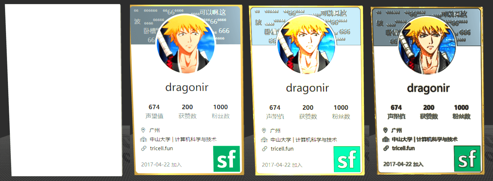
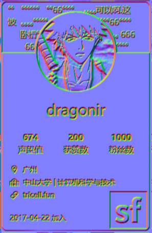

# 粉丝数突破1000，用Three.js给自己颁发一个3D奖牌🥇








## 背景

今天发现 SegmentFault账号的粉丝数量突破1000了，它是我更新的三个博客平台掘金、博客园、segmentFault中首个粉丝突破1000的，于是设计开发这个页面，纪念一下。

## 效果

实现效果图如文章banner所示，页面由包含我的个人信息的奖牌🥇、`1000+ Followers` 模型构成。

> `👀` 在线预览：https://dragonir.github.io/3d/#/segmentfault

## 实现

https://cpetry.github.io/NormalMap-Online/

### 引入资源

首先引入开发功能所需的库，其中 `FBXLoader` 用于加在 `1000+` 字体模型、`OrbitControls` 镜头轨道控制、`TWEEN` 用于生成补间动画、`Stats` 用于开发时性能查看。

```js
import * as THREE from "three";
import { FBXLoader } from "three/examples/jsm/loaders/FBXLoader";
import { OrbitControls } from "three/examples/jsm/controls/OrbitControls";
import { TWEEN } from "three/examples/jsm/libs/tween.module.min.js";
import Stats from "three/examples/jsm/libs/stats.module";
```

### 场景初始化

这部分内容主要用于初始化场景和参数，详细讲解可点击文章末尾链接阅读我之前的文章，本文不再赘述。

```js
container = document.getElementById('container');
renderer = new THREE.WebGLRenderer({ antialias: true });
renderer.setPixelRatio(window.devicePixelRatio);
renderer.setSize(window.innerWidth, window.innerHeight);
renderer.shadowMap.enabled = true;
renderer.shadowMap.needsUpdate = true;
container.appendChild(renderer.domElement);
// 场景
scene = new THREE.Scene();
scene.background = new THREE.TextureLoader().load(backgroundTexture);
// 摄像机
camera = new THREE.PerspectiveCamera(60, window.innerWidth / window.innerHeight, 0.1, 1000);
camera.position.set(0, 0, 0);
camera.lookAt(new THREE.Vector3(0, 0, 0));
// 控制器
controls = new OrbitControls(camera, renderer.domElement);
controls.target.set(0, 0, 0);
controls.enableDamping = true;
controls.enableZoom = false;
controls.enablePan = false;
controls.rotateSpeed = .2;
window.addEventListener('resize', onWindowResize, false);
```

### 光照效果

```js
// 直射光
const cubeGeometry = new THREE.BoxGeometry(0.001, 0.001, 0.001);
const cubeMaterial = new THREE.MeshLambertMaterial({ color: 0xffffff });
const cube = new THREE.Mesh(cubeGeometry, cubeMaterial);
cube.position.set(0, 0, 0);
light = new THREE.DirectionalLight(0xffffff, 1);
light.intensity = 1;
light.position.set(18, 20, 60);
light.castShadow = true;
light.target = cube;
light.shadow.mapSize.width = 512 * 12;
light.shadow.mapSize.height = 512 * 12;
light.shadow.camera.top = 80;
light.shadow.camera.bottom = -80;
light.shadow.camera.left = -80;
light.shadow.camera.right = 80;
scene.add(light);
// 半球光
const ambientLight = new THREE.AmbientLight(0xffffff);
ambientLight.intensity = .8;
scene.add(ambientLight);
// 环境光
const hemisphereLight = new THREE.HemisphereLight(0xffffff, 0xfffc00);
hemisphereLight.intensity = .3;
scene.add(hemisphereLight);
```


#### `💡`

## Three.js库提供的光源

`Three.js` 库提供了一些列光源，而且没种光源都有特定的行为和用途。这些光源包括：

| 光源名称            | 描述                                                                       |
| ----------------------- | ---------------------------------------------------------------------------- |
| `AmbientLight` (环境光） | 这是一种基础光源，它的颜色会添加到整个场景和所有对象的当前颜色上 |
| `PointLight` (点光源)   | 空间中的一点，朝所有的方向发射光线                          |
| `SpotLight` (聚光灯光源) | 这种光源有聚光的效果，类似台灯、天花板上的吊灯，或者手电筒 |
| `DirectionLight` (方向光) | 也称为无限光。从这种光源发出的光线可以看着平行的。例如，太阳光 |
| `HemishpereLight` (半球光) | 这是一种特殊光源，可以用来创建更加自然的室外光线，模拟放光面和光线微弱的天空 |
| `AreaLight` (面光源)    | 使用这种光源可以指定散发光线的平面，而不是空间中的一个点 |
| `LensFlare` (镜头眩光) | 这不是一种光源，但是通过 `LensFlare` 可以为场景中的光源添加眩光效果 |

## DirectionLight属性

方向光源和聚光灯光源很多属性都是相同的。跟聚光灯一样，包围对象空间定义的越紧密，投影的效果越好。可以使用下面几个属性定义这个方块。

```js
var pointColor = "#ff5808";
var directionLight = new THREE.DirectionalLight(pointColor);
directionLight.position.set(-40, 60, -10);
directionLight.castShadow = true;
directionLight.shadowCameraNear = 2;
directionLight.shadowCameraFar = 100;
directionLight.shadowCameraLeft = -50;
directionLight.shadowCameraRight = 50;
directionLight.shadowCameraTop = 50;
directionLight.shadowCameraBottom = -50;
directionLight.distance = 0;
directionLight.intensity = 0.5;
directionLight.shadowMapWidth = 1024;
directionLight.shadowMapHeight = 1024;
scene.add(directionLight);
```

## HemisphereLight半球光光源

使用半球光光源，可以创建出更加贴近自然的光照效果。

构造函数：

```js
new THREE.HeimsphereLight(groundColor, color, intensity)`。
```

属性说明：

* `groundColor`：从地面发出的光线颜色。
* `Color`：从天空发出的光线颜色。
* `intensity`：光线照射的强度。

一、THREE.AmbientLight（环境光）
1，基本介绍
在创建 THREE.AmbientLight 时，颜色会应用到全局。
该光源并没有特别的来源方向，并且 THREE.AmbientLight 不会产生阴影。

2，使用建议
通常，不能将 THREE.AmbientLight 作为场景中唯一的光源，因为它会将场景中的所有物体渲染为相同的颜色，而不管是什么形状。
在使用其他光源（如 THREE.SpotLight 或者 THREE.DirectionLight）的同时使用它，目的是弱化阴影或给场景添加一些额外的颜色。

3，使用样例
由于 THREE.AmbientLight 光源不需要指定位置并且会应用到全局，所以我们只需要指定个颜色，然后将其添加到场景中即可。
1
2
var ambientLight = new THREE.AmbientLight(0x523318);
scene.add(ambientLight);


```js
// 网格
const grid = new THREE.GridHelper(200, 200, 0xffffff, 0xffffff);
grid.position.set(0, -30, -50);
grid.material.transparent = true;
grid.material.opacity = 0.1;
scene.add(grid);

// 创建地面
var planeGeometry = new THREE.PlaneGeometry(200, 200);
// 透明材质显示阴影
var planeMaterial = new THREE.ShadowMaterial({ opacity: .5 });
var plane = new THREE.Mesh(planeGeometry, planeMaterial);
plane.rotation.x = -0.5 * Math.PI;
plane.position.set(0, -30, -50);
plane.receiveShadow = true;
scene.add(plane);

// 添加自定义模型
let segmentMap = new THREE.MeshPhysicalMaterial({map: new THREE.TextureLoader().load(segmentTexture), normalMap: new THREE.TextureLoader().load(normalMapTexture) });
let metalMap = new THREE.MeshPhysicalMaterial({map: new THREE.TextureLoader().load(metalTexture)});
//创建纹理数组
const boxMaps = [metalMap, metalMap, metalMap, metalMap, segmentMap, segmentMap];
box = new THREE.Mesh(new THREE.BoxGeometry(297, 456, 12), boxMaps);
box.material.map(item => {
  item.metalness = .5;
  item.roughness = .4;
  item.refractionRatio = 1;
  return item;
});
box.scale.set(0.085, 0.085, 0.085);
box.position.set(-22, 2, 0);
box.castShadow = true;
meshes.push(box);
scene.add(box);

// 加载文字模型
const manager = new THREE.LoadingManager();
manager.onProgress = async(url, loaded, total) => {
  if (Math.floor(loaded / total * 100) === 100) {
    _this.loadingProcessTimeout && clearTimeout(_this.loadingProcessTimeout);
    _this.loadingProcessTimeout = setTimeout(() => {
      _this.setState({ loadingProcess: Math.floor(loaded / total * 100) });
      Animations.animateCamera(camera, controls, { x: 0, y: 4, z: 60 }, { x: 0, y: 0, z: 0 }, 3600, () => {});
    }, 800);
  } else {
    _this.setState({ loadingProcess: Math.floor(loaded / total * 100) });
  }
};
const fbxLoader = new FBXLoader(manager);
fbxLoader.load(textModel, mesh => {
  mesh.traverse(child => {
    if (child.isMesh) {
      child.castShadow = true;
      child.material.metalness = 1;
      child.material.roughness = .2;
      meshes.push(mesh);
    }
  });
  mesh.position.set(16, -4, 0);
  mesh.rotation.x = Math.PI / 2
  mesh.scale.set(.08, .08, .08);
  scene.add(mesh);
});
```

```js
function onWindowResize() {
  camera.aspect = window.innerWidth / window.innerHeight;
  camera.updateProjectionMatrix();
  renderer.setSize(window.innerWidth, window.innerHeight);
}

function animate() {
  requestAnimationFrame(animate);
  renderer.render(scene, camera);
  stats && stats.update();
  controls && controls.update();
  TWEEN && TWEEN.update();
  box && (box.rotation.y += .04);
}
```

### 礼花动画 `🎉`

```html
<div className="firework_1"></div>
<div className="firework_2"></div>
<!-- ... -->
<div className="firework_10"></div>
```

```css
[class^=firework_] {
  position: absolute;
  width: 0.1rem;
  height: 0.1rem;
  border-radius: 50%;
  transform: scale(8)
}
.firework_1 {
  -webkit-animation: firework_lg 2s both infinite;
  animation: firework_lg 2s both infinite;
  -webkit-animation-delay: 0.3s;
  animation-delay: 0.3s;
  top: 5%;
  left: 5%;
}
@keyframes firework_sm {
  0%, 100% {
    opacity: 0;
  }
  10%, 70% {
    opacity: 1;
  }
  100% {
    box-shadow: -0.5rem 0rem 0 #fffc00, 0.5rem 0rem 0 #fffc00, 0rem -0.5rem 0 #fffc00, 0rem 0.5rem 0 #fffc00, 0.35rem -0.35rem 0 #fffc00, 0.35rem 0.35rem 0 #fffc00, -0.35rem -0.35rem 0 #fffc00, -0.35rem 0.35rem 0 #fffc00;
  }
}
@keyframes firework_lg {
  0%, 100% {
    opacity: 0;
  }
  10%, 70% {
    opacity: 1;
  }
  100% {
    box-shadow: -0.9rem 0rem 0 #fff, 0.9rem 0rem 0 #fff, 0rem -0.9rem 0 #fff, 0rem 0.9rem 0 #fff, 0.63rem -0.63rem 0 #fff, 0.63rem 0.63rem 0 #fff, -0.63rem -0.63rem 0 #fff, -0.63rem 0.63rem 0 #fff;
  }
}
```

实现效果：


> `🔗` 完整代码 https://github.com/dragonir/3d/tree/master/src/containers/SegmentFault

## 总结

本文中主要涉及到的知识点包括：

* `Fog`

## 附录

想了解场景初始化、光照、阴影及其他网格几何体的相关知识，可阅读我的其他文章。如果觉得文章对你有帮助，不要忘了 `一键三连😂`。

* [1]. [Three.js 实现虎年春节3D创意页面](https://juejin.cn/post/7051745314914435102)
* [2]. [Three.js 实现脸书元宇宙3D动态Logo](https://juejin.cn/post/7031893833163997220)
* [3]. [Three.js 实现3D全景侦探小游戏](https://juejin.cn/post/7042298964468564005)
* [4]. [使用Three.js实现炫酷的酸性风格3D页面](https://juejin.cn/post/7012996721693163528)

## 贴图类型

* `map`：材质贴图
* `normalMap`：法线贴图
* `bumpMap`：凹凸贴图
* `envMap`：环境贴图
* `specularMap`：高光贴图
* `lightMap`：光照贴图

## 贴图原理

通过纹理贴图加载器 `TextureLoader()` 去新创建一个贴图对象出来，然后再去调用里面的 `load()` 方法去加载一张图片，这样就会返回一个纹理对象，纹理对象可以作为模型材质颜色贴图 `map` 属性的值，材质的颜色贴图属性 `map` 设置后，模型会从纹理贴图上采集像素值。

代码示例：

```js
var texLoader = new THREE.TextureLoader();
loader.load('assets/models/meta.fbx', function (mesh) {
  mesh.traverse(function (child) {
    if (child.isMesh) {
      if (child.name === '贝塞尔圆') {
        child.material = new THREE.MeshPhysicalMaterial({
          map: texLoader.load("./assets/images/metal.png"),
          metalness: .2,
          roughness: 0.1,
          exposure: 0.4
        });
      }
    }
  });
})
```


MeshStandardMaterial和MeshPhysicalMaterial类是PBR物理材质，可以更好的模拟光照计算，相比较高光网格材质MeshPhongMaterial渲染效果更逼真。

MeshStandardMaterial和MeshPhysicalMaterial两个类基本相似，物理网格材质MeshPhysicalMaterial是MeshStandardMaterial的扩展，MeshPhysicalMaterial可以更好地控制反射率。关于PBR物理材质的大多属性直接查看文档MeshStandardMaterial即可。

PBR物理材质MeshPhysicalMaterial是一个很重要可的材质，如果你想展示一个产品，为了更逼真的渲染效果最好选择该材质，如果游戏为了更好的显示效果可以选择PBR材质MeshPhysicalMaterial，而不是高光材质MeshPhongMaterial。

关于高光网格材质MeshPhongMaterial和PBR物理材质MeshPhysicalMaterial有什么不同可以阅读文章《Three.js次时代和PBR》。阅读这篇文章之前最好先对物理材质有一定的了解MeshPhysicalMaterial。

注意使用物理材质的时候，一般需要设置环境贴图.envMap。

金属度属性.metalness和粗糙度属性.roughness
为了更好的理解PBR物理材质MeshPhysicalMaterial是如何设置一个金属、塑料等材质效果，可以查看文章 《物理材质MeshPhysicalMaterial设置金属效果》

高光网格材质的典型属性是高光颜色.specular和高光亮度.shininess,Threejs物理材质典型的属性是 金属度属性.metalness和粗糙度属性.roughness。

金属度属性.metalness表示材质像金属的程度. 非金属材料，如木材或石材，使用0.0，金属使用1.0，中间没有（通常）. 默认 0.5. 0.0到1.0之间的值可用于生锈的金属外观。如果还提供了粗糙度贴图.metalnessMap，则两个值都相乘。

标准网格材质MeshStandardMaterial：基于物理的标准材料，使用Metallic-Roughness工作流程.

基于物理的渲染（PBR）最近已成为许多3D应用程序的标准, 例如 Unity, Unreal 和 3D Studio Max.

这种方法与旧方法的不同之处在于，不使用近似值来表示光与表面的相互作用，而是使用物理上正确的模型. 我们的想法是，不是在特定照明条件下调整材料以使其看起来更好，而是可以创建一种材料，在所有照明场景下'正确'反应.

在实践中，物理网格材质这比MeshLambertMaterial或MeshPhongMaterial提供了更准确和逼真的结果，代价是计算成本更高一些.

粗糙度属性.roughness材质的粗糙程度. 0.0表示平滑的镜面反射，1.0表示完全漫反射. 默认 0.5. 如果还提供粗糙度贴图.roughnessMap，则两个值相乘.

金属度贴图.metalnessMap和粗糙度贴图.roughnessMap
在讲解Threejs材质的时候，会讲解颜色属性.color和与颜色相对应的颜色贴图.map，讲到高光网格材质MeshPhongMaterial的时候，会提高和高光属性.specular对应的高光贴图.specularMap,类比学习物理材质，物理材质的金属度贴图.metalness对应的是物理材质的金属度属性.metalness，物理材质的粗糙度贴图.roughnessMap对应的是物理材质的粗糙度贴图属性.roughnessMap。

如果一个网格模型Mesh表面都是同一种材质效果，比如金属，比如塑料，没必要使用金属度和粗糙度贴图，直接定义粗糙度和金属度属性即可，如果一个网格模型表面部分区域是金属，部分区域是塑料，部分区域是布料，这种情况下需要粗糙度贴图和金属度贴图。

金属度贴图和粗糙度贴图一般都是3D美术通过PBR次时代流程渲染烘培导出，比如通过substance painter软件，导出PBR物理材质需要的金属度贴图和粗糙度贴图，对于程序员而言直接加载解析就可以。

金属度贴图.metalnessMap纹理的蓝色通道用于改变材料的金属度.

粗糙度贴图.roughnessMap纹理的绿色通道用于改变材料的粗糙度

其它属性和贴图
物理网格材质和其它的网格材质具有一些相同的属性，可以类比记忆学习，具体的信息可以参考Threejs文档MeshStandardMaterial的相关介绍，比如材质发光颜色属性.emissive、发光贴图属性.emissiveMap、环境贴图属性.envMap、环境贴图系数.envMapIntensity、光照阴影贴图属性.lightMap、法线贴图属性.normalMap...

手动设置贴图代码案例
在大多数3D项目中，网格模型的物理材质一般需要3D美术提供颜色贴图map、法线贴图normalMap、金属度贴图roughnessMap、粗糙度贴图metalnessMap四张贴图，环境贴图不同的项目有些时候可以通用，至于其他贴图看情况需要，比如发光贴图emissiveMap，如果有电源灯等发光表面，这时候一般需要美术提供发光贴图emissiveMap。

