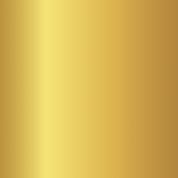
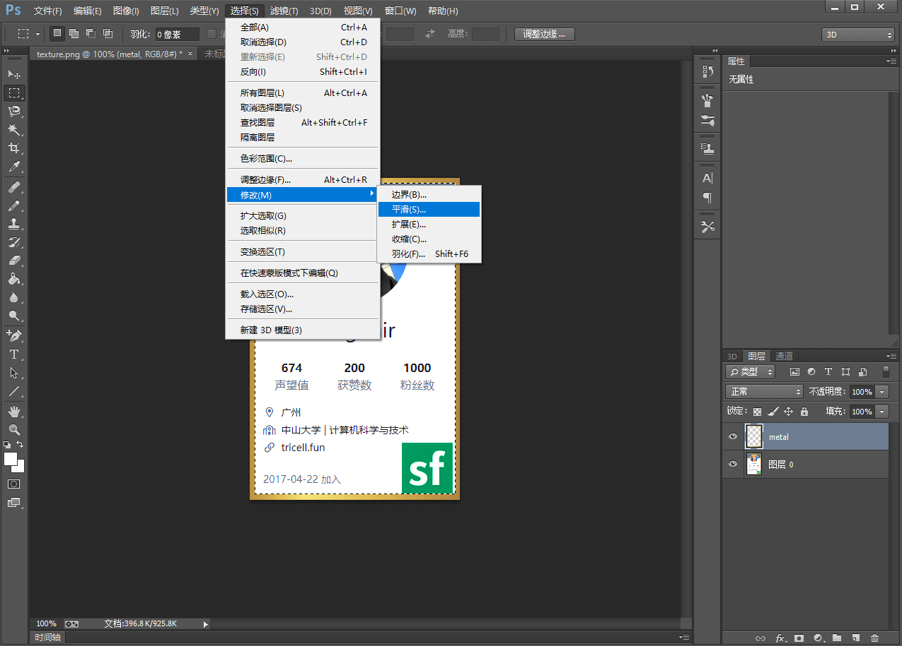
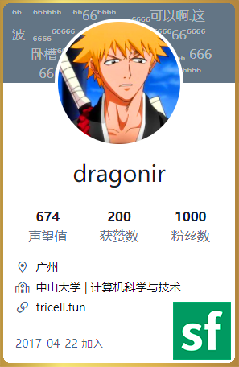
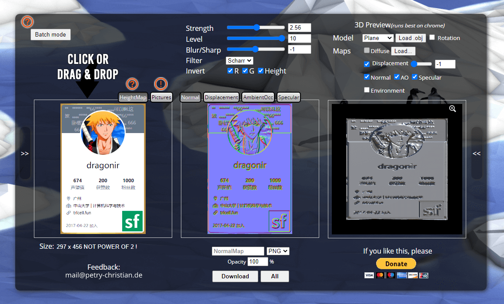

# 粉丝数突破1000，用Three.js给自己颁发一个3D奖牌🥇


## 背景

今天发现 `SegmentFault` 账号的粉丝数量突破 `1000` 了，它是我更新的三个博客平台掘金、博客园、`SegmentFault` 中首个粉丝突破 `1000` 的，于是设计开发这个页面，纪念一下。

本文使用 `React + Three.js` 技术栈，实现粉丝突破 `1000` 的 `3D` 纪念页面，包含的主要知识点包括：`Three.js` 提供的光源、`DirectionLight` 平行光、`HemisphereLight` 半球光源、`AmbientLight` 环境光、奖牌素材生成、贴图知识、`MeshPhysicalMaterial` 物理材质、`TWEEN` 镜头补间动画、`CSS` 礼花动画等。

## 效果

实现效果图如文章 `Banner` 所示，页面由包含我的个人信息的奖牌 `🥇`、`1000+ Followers` 模型构成，通过以下链接可以实时预览 `🤣`。

> `👀` 在线预览：<https://dragonir.github.io/3d/#/segmentfault>

## 实现

### 引入资源

首先引入开发功能所需的库，其中 `FBXLoader` 用于加在 `1000+` 字体模型、`OrbitControls` 镜头轨道控制、`TWEEN` 用于生成补间动画、`Stats` 用于开发时性能查看。

```js
import * as THREE from "three";
import { FBXLoader } from "three/examples/jsm/loaders/FBXLoader";
import { OrbitControls } from "three/examples/jsm/controls/OrbitControls";
import { TWEEN } from "three/examples/jsm/libs/tween.module.min.js";
import Stats from "three/examples/jsm/libs/stats.module";
```

### 场景初始化

这部分内容主要用于初始化场景和参数，详细讲解可点击文章末尾链接阅读我之前的文章，本文不再赘述。

```js
container = document.getElementById('container');
renderer = new THREE.WebGLRenderer({ antialias: true });
renderer.setPixelRatio(window.devicePixelRatio);
renderer.setSize(window.innerWidth, window.innerHeight);
renderer.shadowMap.enabled = true;
renderer.shadowMap.needsUpdate = true;
container.appendChild(renderer.domElement);
// 场景
scene = new THREE.Scene();
scene.background = new THREE.TextureLoader().load(backgroundTexture);
// 摄像机
camera = new THREE.PerspectiveCamera(60, window.innerWidth / window.innerHeight, 0.1, 1000);
camera.position.set(0, 0, 0);
camera.lookAt(new THREE.Vector3(0, 0, 0));
// 控制器
controls = new OrbitControls(camera, renderer.domElement);
controls.target.set(0, 0, 0);
controls.enableDamping = true;
controls.enableZoom = false;
controls.enablePan = false;
controls.rotateSpeed = .2;
window.addEventListener('resize', onWindowResize, false);
```

> `📌` 为了更好的视觉效果，为 `OrbitControls` 设置了缩放、平移禁用和减小默认旋转速度

### 光照效果

```js
// 直射光
const cubeGeometry = new THREE.BoxGeometry(0.001, 0.001, 0.001);
const cubeMaterial = new THREE.MeshLambertMaterial({ color: 0xffffff });
const cube = new THREE.Mesh(cubeGeometry, cubeMaterial);
cube.position.set(0, 0, 0);
light = new THREE.DirectionalLight(0xffffff, 1);
light.intensity = 1;
light.position.set(18, 20, 60);
light.castShadow = true;
light.target = cube;
light.shadow.mapSize.width = 512 * 12;
light.shadow.mapSize.height = 512 * 12;
light.shadow.camera.top = 80;
light.shadow.camera.bottom = -80;
light.shadow.camera.left = -80;
light.shadow.camera.right = 80;
scene.add(light);
// 半球光
const ambientLight = new THREE.AmbientLight(0xffffff);
ambientLight.intensity = .8;
scene.add(ambientLight);
// 环境光
const hemisphereLight = new THREE.HemisphereLight(0xffffff, 0xfffc00);
hemisphereLight.intensity = .3;
scene.add(hemisphereLight);
```

#### `💡` Three.js 提供的光源

`Three.js` 库提供了一些列光源，而且没种光源都有特定的行为和用途。这些光源包括：

| 光源名称            | 描述                                                                       |
| ----------------------- | ---------------------------------------------------------------------------- |
| `AmbientLight` (环境光） | 这是一种基础光源，它的颜色会添加到整个场景和所有对象的当前颜色上 |
| `PointLight` (点光源)   | 空间中的一点，朝所有的方向发射光线                          |
| `SpotLight` (聚光灯光源) | 这种光源有聚光的效果，类似台灯、天花板上的吊灯，或者手电筒 |
| `DirectionLight` (平行光) | 也称为无限光。从这种光源发出的光线可以看着平行的。例如，太阳光 |
| `HemishpereLight` (半球光) | 这是一种特殊光源，可以用来创建更加自然的室外光线，模拟放光面和光线微弱的天空 |
| `AreaLight` (面光源)    | 使用这种光源可以指定散发光线的平面，而不是空间中的一个点 |
| `LensFlare` (镜头眩光) | 这不是一种光源，但是通过 `LensFlare` 可以为场景中的光源添加眩光效果 |

#### `💡` THREE.DirectionLight 平行光

`THREE.DirectionLight` 可以看作是距离很远的光，它发出的所有光线都是相互平行的。平行光的一个范例就是太阳光。平行光不像上面的聚光灯（通过 distance 和 exponent 属性来微调）那样离目标越远越暗淡。被平行光照亮的整个区域接受到的光强是一样的。

**构造函数**：

```js
new THREE.DirectionLight(color);
```

**属性说明**：

* `position`：光源在场景中的位置。
* `target`：目标。使用 `THREE.DirectionLight` 光源时，它的指向很重要。使用 `target` 属性，你可以将 `THREE.SpotLight` 光源指向场景中的特定对象或位置。注意，此属性需要一个 `THREE.Object3D` 对象（如 `THREE.Mesh`）。
* `intensity`：光源照射的强度。默认值：`1`。
* `castShadow`：投影。如果设置为 `true`，这个光源就会生成阴影。
* `onlyShadow`：仅阴影。如果此属性设置为 `true`，则该光源只生成阴影，而不会在场景中添加任何光照。
* `shadow.camera.near`：投影近点。表示距离光源的哪一个位置开始生成阴影。
* `shadow.camera.far`：投影远点。表示到距离光源的哪一个位置可以生成阴影。
* `shadow.camera.left`：投影左边界。
* `shadow.camera.right`：投影右边界。
* `shadow.camera.top`：投影上边界。
* `shadow.camera.bottom`：投影下边界。
* `shadow.map.width` 和 `shadow.map.height`：阴影映射宽度和阴影映射高度。决定了有多少像素用来生成阴影。当阴影具有锯齿状边缘或看起来不光滑时，可以增加这个值。在场景渲染之后无法更改。两者的默认值均为：`512`。

#### `💡` THREE.HemisphereLight 半球光光源

使用半球光光源，可以创建出更加贴近自然的光照效果。

**构造函数**：

```js
new THREE.HeimsphereLight(groundColor, color, intensity);
```

**属性说明**：

* `groundColor`：从地面发出的光线颜色。
* `Color`：从天空发出的光线颜色。
* `intensity`：光线照射的强度。

#### `💡` THREE.AmbientLight 环境光

在创建 `THREE.AmbientLight` 时，颜色会应用到全局。该光源并没有特别的来源方向，并且 `THREE.AmbientLight` 不会产生阴影。

**构造函数**：

```js
new THREE.AmbientLight(color);
```

**使用建议**：

* 通常，不能将 `THREE.AmbientLight` 作为场景中唯一的光源，因为它会将场景中的所有物体渲染为相同的颜色，而不管是什么形状。
* 在使用其他光源（如 `THREE.SpotLight` 或者 `THREE.DirectionLight`）的同时使用它，目的是弱化阴影或给场景添加一些额外的颜色。
* 由于 `THREE.AmbientLight` 光源不需要指定位置并且会应用到全局，所以我们只需要指定个颜色，然后将其添加到场景中即可。

### 添加网格和地面

```js
// 网格
const grid = new THREE.GridHelper(200, 200, 0xffffff, 0xffffff);
grid.position.set(0, -30, -50);
grid.material.transparent = true;
grid.material.opacity = 0.1;
scene.add(grid);
// 创建地面
var planeGeometry = new THREE.PlaneGeometry(200, 200);
// 透明材质显示阴影
var planeMaterial = new THREE.ShadowMaterial({ opacity: .5 });
var plane = new THREE.Mesh(planeGeometry, planeMaterial);
plane.rotation.x = -0.5 * Math.PI;
plane.position.set(0, -30, -50);
plane.receiveShadow = true;
scene.add(plane);
```

### 创建奖牌

#### `💡` 奖牌UI素材生成

**奖牌上下面和侧面贴图制作**：

为了生成的奖牌有黄金质感，本例中使用该材质贴图，来生成亮瞎眼的 `24K纯金` 效果 `🤑`。



**奖牌正面和背面贴图制作**：

奖牌的正面和背面使用的贴图是SegmentFault个人中心页的截图，为了更具有金属效果，我用 `👆` 上面金属材质贴图给它添加了一个带有圆角的边框。

**生成圆角金属边框具体方法**：截图上面添加金属图层 `->` 使用框选工具框选需要删除的内容 `->` 点击选择 `->` 点击修改 `->` 点击平滑 `->` 输入合适的圆角大小 `->` 删除选区 `->` 合并图层 `->` 完成。



最终的正反面的材质贴图如 `👇` 下图所示，为了显示更清晰，我在 `Photoshop` 中同时修改了图片的`对比度` 和 `饱和度`，并加了 `SegmentFault` 的 `Logo` 在上面。



**奖牌正面和背面的法相贴图制作**：

为了生成凹凸质感，就需要为模型添加 `法相贴图`。使用 `👆` 上面已经生成的材质贴图，就可以使用在线工具自动生成法相贴图。



> `🚪` 法相贴图在线制作工具传送门：[NormalMap-Online](https://cpetry.github.io/NormalMap-Online/)

通过多次调节优化，最终使用的法相贴图如 `👇` 下图所示。


使用上面生成的素材，现在进行奖牌模型的构建。

```js
// 添加自定义模型
let segmentMap = new THREE.MeshPhysicalMaterial({map: new THREE.TextureLoader().load(segmentTexture), normalMap: new THREE.TextureLoader().load(normalMapTexture) });
let metalMap = new THREE.MeshPhysicalMaterial({map: new THREE.TextureLoader().load(metalTexture)});
//创建纹理数组
const boxMaps = [metalMap, metalMap, metalMap, metalMap, segmentMap, segmentMap];
box = new THREE.Mesh(new THREE.BoxGeometry(297, 456, 12), boxMaps);
box.material.map(item => {
  item.metalness = .5;
  item.roughness = .4;
  item.refractionRatio = 1;
  return item;
});
box.scale.set(0.085, 0.085, 0.085);
box.position.set(-22, 2, 0);
box.castShadow = true;
meshes.push(box);
scene.add(box);
```


上图流程分别对应

* `图1`：创建没有贴图的 `BoxGeometry`，只是一个白色的立方体。
* `图2`：立方体添加 `材质贴图`，此时没有凹凸效果。
* `图3`：立方体添加 `法相贴图`，此时产生凹凸效果。
* `图4`：调节立方体材质的 `金属度`、`粗糙程度` 和 `反射率`，更具有真实感。

#### `💡` Three.js 中的贴图

##### 贴图类型

* `map`：材质贴图
* `normalMap`：法线贴图
* `bumpMap`：凹凸贴图
* `envMap`：环境贴图
* `specularMap`：高光贴图
* `lightMap`：光照贴图

##### 贴图原理

通过纹理贴图加载器 `TextureLoader()` 去新创建一个贴图对象出来，然后再去调用里面的 `load()` 方法去加载一张图片，这样就会返回一个纹理对象，纹理对象可以作为模型材质颜色贴图 `map` 属性的值，材质的颜色贴图属性 `map` 设置后，模型会从纹理贴图上采集像素值。

#### `💡` MeshPhysicalMaterial 物理材质

`MeshPhysicalMaterial` 类是 `PBR` 物理材质，可以更好的模拟光照计算，相比较高光网格材质`MeshPhongMaterial` 渲染效果更逼真。

> 如果你想展示一个产品，为了更逼真的渲染效果最好选择该材质，如果游戏为了更好的显示效果可以选择 `PBR` 材质 `MeshPhysicalMaterial`，而不是高光材质 `MeshPhongMaterial`。

##### 特殊属性

* 金属度属性 `.metalness` 表示材质像金属的程度。非金属材料，如木材或石材，使用 `0.0`，金属使用 `1.0`，中间没有（通常）. 默认 `0.5`. `0.0` 到 `1.0` 之间的值可用于生锈的金属外观。如果还提供了粗糙度贴图 `.metalnessMap`，则两个值都相乘。
* 粗糙度属性.roughness材质的粗糙程度. `0.0` 表示平滑的镜面反射，`1.0` 表示完全漫反射. 默认 `0.5`. 如果还提供粗糙度贴图 `.roughnessMap`，则两个值相乘.
* 金属度贴图 `.metalnessMap` 纹理的蓝色通道用于改变材料的金属度.
* 粗糙度贴图 `.roughnessMap` 纹理的绿色通道用于改变材料的粗糙度。

> `📌` 注意使用物理材质的时候，一般需要设置环境贴图 `.envMap`。

### 加载1000+文字模型

```js
const manager = new THREE.LoadingManager();
manager.onProgress = async(url, loaded, total) => {
  if (Math.floor(loaded / total * 100) === 100) {
    _this.loadingProcessTimeout && clearTimeout(_this.loadingProcessTimeout);
    _this.loadingProcessTimeout = setTimeout(() => {
      _this.setState({ loadingProcess: Math.floor(loaded / total * 100) });
      Animations.animateCamera(camera, controls, { x: 0, y: 4, z: 60 }, { x: 0, y: 0, z: 0 }, 3600, () => {});
    }, 800);
  } else {
    _this.setState({ loadingProcess: Math.floor(loaded / total * 100) });
  }
};
const fbxLoader = new FBXLoader(manager);
fbxLoader.load(textModel, mesh => {
  mesh.traverse(child => {
    if (child.isMesh) {
      child.castShadow = true;
      child.material.metalness = 1;
      child.material.roughness = .2;
      meshes.push(mesh);
    }
  });
  mesh.position.set(16, -4, 0);
  mesh.rotation.x = Math.PI / 2
  mesh.scale.set(.08, .08, .08);
  scene.add(mesh);
});
```

#### 补间动画

相机移动实现漫游等动画

```js
animateCamera: (camera, controls, newP, newT, time = 2000, callBack) => {
  var tween = new TWEEN.Tween({
    x1: camera.position.x, // 相机x
    y1: camera.position.y, // 相机y
    z1: camera.position.z, // 相机z
    x2: controls.target.x, // 控制点的中心点x
    y2: controls.target.y, // 控制点的中心点y
    z2: controls.target.z, // 控制点的中心点z
  });
  tween.to({
    x1: newP.x,
    y1: newP.y,
    z1: newP.z,
    x2: newT.x,
    y2: newT.y,
    z2: newT.z,
  }, time);
  tween.onUpdate(function (object) {
    camera.position.x = object.x1;
    camera.position.y = object.y1;
    camera.position.z = object.z1;
    controls.target.x = object.x2;
    controls.target.y = object.y2;
    controls.target.z = object.z2;
    controls.update();
  });
  tween.onComplete(function () {
    controls.enabled = true;
    callBack();
  });
  tween.easing(TWEEN.Easing.Cubic.InOut);
  tween.start();
}
```

### 动画更新

```js
function onWindowResize() {
  camera.aspect = window.innerWidth / window.innerHeight;
  camera.updateProjectionMatrix();
  renderer.setSize(window.innerWidth, window.innerHeight);
}
function animate() {
  requestAnimationFrame(animate);
  renderer.render(scene, camera);
  stats && stats.update();
  controls && controls.update();
  TWEEN && TWEEN.update();
  box && (box.rotation.y += .04);
}
```

### 礼花动画 `🎉`

```html
<div className="firework_1"></div>
<div className="firework_2"></div>
<!-- ... -->
<div className="firework_10"></div>
```

```css
[class^=firework_] {
  position: absolute;
  width: 0.1rem;
  height: 0.1rem;
  border-radius: 50%;
  transform: scale(8)
}
.firework_1 {
  -webkit-animation: firework_lg 2s both infinite;
  animation: firework_lg 2s both infinite;
  -webkit-animation-delay: 0.3s;
  animation-delay: 0.3s;
  top: 5%;
  left: 5%;
}
@keyframes firework_sm {
  0%, 100% {
    opacity: 0;
  }
  10%, 70% {
    opacity: 1;
  }
  100% {
    box-shadow: -0.5rem 0rem 0 #fffc00, 0.5rem 0rem 0 #fffc00, 0rem -0.5rem 0 #fffc00, 0rem 0.5rem 0 #fffc00, 0.35rem -0.35rem 0 #fffc00, 0.35rem 0.35rem 0 #fffc00, -0.35rem -0.35rem 0 #fffc00, -0.35rem 0.35rem 0 #fffc00;
  }
}
@keyframes firework_lg {
  0%, 100% {
    opacity: 0;
  }
  10%, 70% {
    opacity: 1;
  }
  100% {
    box-shadow: -0.9rem 0rem 0 #fff, 0.9rem 0rem 0 #fff, 0rem -0.9rem 0 #fff, 0rem 0.9rem 0 #fff, 0.63rem -0.63rem 0 #fff, 0.63rem 0.63rem 0 #fff, -0.63rem -0.63rem 0 #fff, -0.63rem 0.63rem 0 #fff;
  }
}
```

实现效果：


> `🔗` 完整代码 <https://github.com/dragonir/3d/tree/master/src/containers/SegmentFault>

## 总结

本文中主要涉及到的知识点包括：

* `Three.js` 提供的光源
* `THREE.DirectionLight` 平行光
* `THREE.HemisphereLight` 半球光光源
* `THREE.AmbientLight` 环境光
* 奖牌 `UI` 素材生成
* `Three.js` 中的贴图
* `MeshPhysicalMaterial` 物理材质
* `TWEEN` 镜头补间动画
* `CSS` 礼花动画

## 附录

想了解场景初始化、光照、阴影及其他网格几何体的相关知识，可阅读我的其他文章。如果觉得文章对你有帮助，不要忘了 `一键三连😂`。

* [1]. [Three.js 实现虎年春节3D创意页面](https://juejin.cn/post/7051745314914435102)
* [2]. [Three.js 实现脸书元宇宙3D动态Logo](https://juejin.cn/post/7031893833163997220)
* [3]. [Three.js 实现3D全景侦探小游戏](https://juejin.cn/post/7042298964468564005)
* [4]. [使用Three.js实现炫酷的酸性风格3D页面](https://juejin.cn/post/7012996721693163528)
* [5]. 环境贴图来源：[dribbble](https://dribbble.com/)
* [6]. 字体模型来源：[sketchfab](https://sketchfab.com/)
